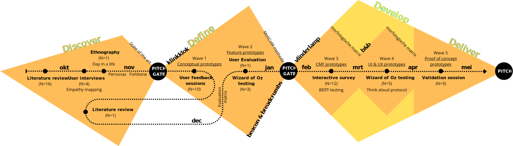

# Orion
*Een hulpmiddel dat de nachtrust en gemoedsrust van een mantelzorger van een persoon met dementie verbetert, door de nachtelijke oriëntatie in ruimte en tijd en de slaapkwaliteit van de persoon met dementie te ondersteunen.*

*Projectteam: Elias Verdegem; Viktor Fabry*

02/05/2025 `TODO❗️update datum`

`PD` persoon met dementie  
`MZ` mantelzorger (bv. partner)  
`PZ` professionele zorgverlener  
`IZ` informele zorgverlener (bv. familielid)

## Samenvatting

_Dit project richt zich op het probleem van **verstoorde dag-nachtritmes bij mensen met dementie**, wat zowel hun slaap als de nachtrust van hun verzorgers verstoort._

Het probleem werd geanalyseerd door middel van **bevragingen en observaties**, waarbij de verschillende aspecten en gradaties werden geïdentificeerd. Vervolgens werd met behulp van **vijf iteraties aan prototypes** onderzocht hoe het zintuiglijke spectrum optimaal benut kan worden om de PD in zijn zelfstandigheid te ondersteunen.

Een combinatie van **visuele en auditieve prikkels** op strategische plaatsen doorheen de nachthal **begeleidt de PD bij een nachtelijk toiletbezoek** en **voorkomt het mogelijks daarop volgende nachtelijke dolen**.

✨ **_Slimme lampjes verlichten de route en vormen oriëntatiepunten._** 
⌛ **_Een geruststellende herkenbare stem herinnert aan tijd en nachtrust._** 
❗ **_Bij afwijking wordt de MZ meteen visueel gewaarschuwd._**

Door de hulp kan de PD ’s nachts zijn plan trekken. De MZ kan met een gerust hart doorslapen.

**_Orion_** *belooft zo de zelfstandigheid van mensen met dementie te bevorderen, hun onrust te verminderen en de belasting voor mantelzorgers te verlichten en maakt zo thuiszorg aangenamer en duurzamer.*

`TODO❗️update hero image`

`TODO❗️insert explainer video`

  
  
  

## Introductie

> _“Wanneer de nachten te zwaar worden, moeten mantelzorgers [hun partner] loslaten – niet omdat ze willen, maar omdat ze niet meer kunnen.” – zorgmedewerker WZC_

Mensen worden steeds ouder. In 2023 in België gemiddeld 82,5 jaar  (PwC, 2024) [^1]. De keerzijde van de medaille is dat hierdoor chronische ouderdomsziektes zoals Alzheimer's vaker voorkomen. **Op vandaag krijgt ongeveer 1 op 5 in de loop van zijn of haar leven een vorm van dementie.** Dementie is een wereldwijd probleem dat 55 miljoen mensen treft en jaarlijks 10 miljoen nieuwe gevallen kent. In België lijden ongeveer 200.000 personen aan een vorm van dementie, en door de vergrijzing wordt verwacht dat dit aantal tegen 2070 zal verdubbelen (Exptertisecentrum Dementie, 2021) [^2]. In het toekomstige value based healthcare (VBHC) model (PwC, 2024) [^1] **wordt de zorgverlening verder richting de eerstelijns- en nuldelijnszorg verschoven**. Dit moet onder andere een oplossing bieden aan het groeiende personeeltekort in de gezondheidssector. **Deze evolutie onderstreept het belang van de informele zorgverlener en in het bijzonder de mantelzorger in het geval van zorg voor mensen met dementie.**

**Personen met dementie hebben moeite met een standaard slaappatroon, wat leidt tot nachtelijke onrust en dwalen** (Thomas & Ritter, 2022) [^3]. Dit verstoort niet alleen de nachtrust van de persoon met dementie zelf, maar ook die van hun mantelzorgers, vaak de partner. **Deze aanhoudende belasting kan leiden tot fysieke en emotionele uitputting van de mantelzorger**, wat de beslissing tot een vaste opname in een woonzorgcentrum kan bespoedigen.

**Het doel van dit project is om een oplossing te ontwikkelen die de nachtrust van PD en hun MZ bevordert, zodat thuiszorg langer mogelijk blijft**. Daarbij is het cruciaal om de autonomie van de zorgbehoevende te ondersteunen en de druk op MZ te verlagen. Dit vereist oplossingen die rekening houden met de **uiteenlopende en veranderende cognitieve en zintuiglijke capaciteiten van PD**. De focus ligt op het minimaliseren van nachtelijke interventies en het ondersteunen van een zelfstandig dag-nachtritme. De ontwikkelde oplossing moet bovendien flexibel zijn en ook in een woonzorgcentrum gebruikt kunnen worden om de professionele zorgverleners te ontlasten.

## Methodologie

De methodologie volgt het **Triple diamond** ontwerpmodel, bestaande uit vier fasen: **Discover**, **Define**, **Develop** en **Deliver**.

In de fase **Discover** wordt via een **Literature review (N=16)** onderzoek gedaan naar uitdagingen in de zorg voor personen met dementie. Vervolgens vinden **User interviews (N=4)** plaats met mantelzorgers, familieleden en zorgverleners, waarbij gebruik wordt gemaakt van **empathy mapping**. Daarnaast wordt via **Ethnography (N=1)** de dagelijkse praktijk geobserveerd in dagverblijf DVC Robijn, afdeling dementie, binnen WZC Sint Eligius. De verzamelde inzichten worden gestructureerd weergegeven in een **fishbone diagram**, waarbij vooral het verstoorde dag-nachtritme en de daarmee samenhangende belasting voor mantelzorgers naar voren komen als prioritair probleem. Een aanvullend **state of the art**-onderzoek leidt tot het initiële concept van de klinkklok als vertrekpunt voor verdere testen.

Tijdens de **Define**-fase worden prototypes iteratief ontwikkeld en geëvalueerd in testwaves, met elk een specifieke focus. In **Wave 1** worden **conceptuele prototypes** (klinkklok, vloerlicht, breadcrumbs) onderzocht via **User feedback sessions (N=7)** met mantelzorgers en professionele zorgverleners in Huize Ter Walle, en via **User feedback sessions (N=3)** in DVC Robijn. Nadien wordt een stap teruggenomen met een gerichte **Literature review (N=1)** over de problematiek van dwalen en sundowning. In **Wave 2** worden de bevindingen toegepast als **Feature prototypes** (beacon, breadcrumb, kussen, knuffel) die zich richten op het vaststellen van de featureset via een **Evaluation matrix**, met **Wizard of Oz testing (N=3)** bij ouderen met en zonder dementie. Voorafgaand vindt er een ongeplande **User evaluation (N=1)** plaats met een expert in fixatie en valpreventie. De resultaten worden geprioriteerd volgens de **MoSCoW-methode**, wat resulteert in een productconcept bestaande uit licht en geluid nabij het bed, de slaapkamerdeur en het sanitair, inclusief een feedbacksysteem voor mantelzorgers. Uitdagingen liggen in acceptatie, adaptatie en tijdige implementatie. Opties voor uitbreiding naar andere doelgroepen worden onderzocht om het product reeds in een vroeg stadium van de ziekte te introduceren.

In de fase **Develop** wordt via **CMF prototypes** (vlinderlampjes) de uiteindelijke look & feel bepaald, met behulp van een **Interactive survey (N=12)** bij ouderen en ouders van jonge kinderen via **BERT-testing**. In **Wave 4** worden de **UI & UX prototypes** geëvalueerd via **Wizard of Oz testing (N=5)** met het **Think aloud protocol**.

De laatste fase **Deliver** omvat de evaluatie van volledig autonome prototypes (**Wave 5**) als **pilot testing** via een **Validation session (N=3)**.

## Discovery

### Doelstellingen
-  Een begrip krijgen van wat de ziekte inhoudt.
-  Een diepgaand begrip krijgen van de problematiek rond dementie en de impact op mantelzorgers.
-  Het identificeren van de belangrijkste noden en behoeften van mantelzorgers en personen met dementie.
-  Het in kaart brengen van bestaande technologieën en oplossingen, en het identificeren van onderbelichte thema’s.

### Materiaal & methoden
`TODO❗️meer detail: sample sizes, technieken, etc`
1. Literatuurstudie: Hierin wordt gefocust op een onderbouwd begrip vormen van de ziekte, de problematieken die ermee gepaard gaan, de effecten op de persoon met dementie en zijn omgeving en de bestaande technologieën die hierin hulp trachten te bieden. Dit doos middel van analyse van wetenschappelijke artikelen, rapporten en andere relevante documenten over dementie, mantelzorg en technologische hulpmiddelen.
2. Gebruikersinterviews: Door in gesprek te gaan met mantelzorgers trachten we pijnpunten en lichtpunten doorheen de dag bloot te leggen.
3. Ethnografisch onderzoek: Dit in de vorm van A Day in the Life. We trachten de positieve en negatieve effecten van dagopvang in kaart te brengen en de doelgroep van dichtbij te observeren om ons begrip van de ziekte scherper te stellen. Dit waren observaties, field notes en contextual inquiries binnen een dagcentrum.

### Resultaten
#### Literature review (N=16)
Dementie is een complexe ziekte met uiteenlopende symptomen, dewelke uiteenlopende lasten met zich meebrengen voor zowel de persoon zelf, als de (informele) zorgverleners. Er is veel onderzoek en innovatie gaande en vernieuwingen spitsen zich toe op uiteenlopende problematieken.
-  Communicatie en sociale interactie
-  Fysieke veiligheid en bewegingsvrijheid
-  Cognitieve stimulatie en geheugenondersteuning
-  Ondersteuning voor dagelijkse zorgactiviteiten en zelfredzaamheid

Hoewel de meeste technologieën zijn gericht op de patiënt, zijn er weinig toepassingen specifiek gericht op de emotionele ondersteuning en stressreductie voor mantelzorgers zelf. Artificiële intelligentie is een belangrijke trend die hierin nieuwe mogelijkheden biedt. Omwille van de leeftijd en de achteruitgaande cognitieve capaciteiten van het doelpubliek brengt de introductie van nieuwe technologieën enkele belangrijke complexiteiten met zich mee.

#### User interviews (N=3)
Wat in de literatuurstudie nog onderbelicht was, maar in de praktrijk sterk naar voor komt, zijn de moeilijke nachten.

> _“Zit hij daar midden in de nacht aan de keukentafel, volledig gekleed, z’n krant aan ‘t lezen.”_ – mantelzorger en partner

Mantelzorgers willen de overstap van thuiszorg naar een woonzorgcentrum zo lang mogelijk uitstellen. Uit schrik om gescheiden te zijn, maar ook uit schaamte om te moeten toegeven dat ze het niet meer aankunnen.

> _“Na een week in kortverblijf is hij sterk achteruit gegaan. Sindsdien komt hij er niet meer bij zitten wanneer er bezoek is.”_ – tweedelijn informele zorgverlener (zoon)

  
  
  

#### Ethnography (N=1)

Mantelzorgers zijn zwaar, slechts periodiek onderbroken, belast door de zorg voor personen met dementie.

> “Wanneer we dan vragen hoe het met ze gaat, barsten ze in tranen uit.” – professionele zorgverlener

Dagcentra of een uitstap met een vrijwilliger of tweede lijn mantelzorger bieden een moment van decompressie. Ze zijn een in de tijd afgebakende oplossing voor mensen in een vroeg stadium van dementie. Een oplossing die ook in de overige uren van de dag de autonomie van de zorgbehoevende ondersteunt en tegelijkertijd de druk op mantelzorgers verlaagt, zou de mentale en fysieke last kunnen verlichten en mogelijk de kwaliteit van leven voor beide partijen verbeteren. De aard en de progressie van dementie heeft een grote invloed op de benodigde zorg en ondersteuning alsook de fysieke en cognitieve capaciteiten van de zorgbehoevende. 

De voornaamste factoren zijn weergegeven in het fishbone diagram.

 

Ook in deze gesprekken kwam de problematiek van het nachtelijk dolen naar boven.

> _“Soms kruipen ze bij een ander in bed.”_ – professionele zorgverlener

> _“Ons gebouw is vierkant. Ze lopen hele nacht in rondjes. Alle deuren zien er hier hetzelfde uit.”_ – professionele zorgverlener

  
  
  

### Conclusies & implicaties

`TODO❗️herschrijf, meer gebald en theoretisch onderbouwd`
`TODO❗️De quotes in de resultaten zijn sterk. De implicaties kunnen echter sterker worden geformuleerd. Wat leren we bijvoorbeeld uit de 3 user interviews, en wat zijn daar de implicaties van? - Maak gebruik van woorden in het vet bij lange doorlopende teksten. - Licht nog beter toe aan de lezer wat we te zien krijgen (e.g. licht toe dat je bij de conclusies en implicaties onder ‘note’ design requirements formuleert)`

Om de nachtrust van de MZ te verbeteren moeten op zoek naar een manier om zelfstandigheid van de PD te verbeteren gedurende de nacht. De drempel voor gebruik moet ook laag blijven, het moet zo intuïtief mogelijk gebruikt kunnen worden. Optie om de mantelzorger te alarmeren indien nodig moet ook zeker geïmplementeerd worden, dit zal zorgen voor meer vertrouwen in het product van de mantelzorger zelf. Vaak zijn huidige producten duur in aankoop of lastig in gebruik, dit moet ook geprobeerd worden te doorbreken. De ziekte is voor iedereen anders, en evolueert ook met de tijd. Een op maat oplossing voor elke persoon is noodzakelijk. Het doel is om de nachtrust van de mantelzorger ook weldegelijk prioriteit. Het mag niet het geval zijn dat het product de mantelzorger zou wekken. Als de persoon met dementie buiten de kamer is, is het ook noodzakelijk dat het product dit meedeelt aan de mantelzorger, als deze ontwaakt.

> [!NOTE]
> **_Design Requirements_**
> - 1.1 Ontlast de mantelzorger door een minder verstoorde nachtrust
> - 2.1 Geeft PD meer zelfstandigheid en eigenwaarde en werkt geruststellend en ondersteunend
> - 2.1.2 Oriënteert de PD bij een nachtelijk toiletbezoek
> - 2.1.2 Oriënteert de PD in de tijd (dag-nacht-onderscheid)
> - 2.4.1 Reist mee met de PD doorheen het verloop van de ziekte als vertrouwd element

> 📌 **_Design Requirements_**
> - 1.1 test
> - 1.1 test

> 💡 **_Design Requirements_**
> - 1.1 test
> - 1.1 test

> ❓ **_Kunnen we?_**
> - d
> - d

> 🔍 **_Kunnen we?_**
> - d
> - d

De bevindingen worden in een design sprint verzameld en verwerkt tot een concreet product.

  

Als houvast voor de volgende fase vertalen we het probleem en de mogelijke oplossing in storyboards.

Huidige situatie

  

Oriëntatie in tijd (dag-nacht-onderscheid)

  

Oriëntatie in ruimte (nachtelijke wayfinding)

  

En een mockup van hoe dit product er uit zou kunnen zien.

  
  

## Definition

### Doestellingen
- Meer gedetailleerd definiëren welk technologisch hulpmiddel op welke manier en in welke contexten een verschil maken t.o.v. de huidige situatie m.b.t. het geïdentificeerde probleem.
- De doeltreffendeheid en acceptie van deze technologie nagaan bij de doelgroep in uiteenlopende, realistische contexten.
-  Het opstellen van een volledige en specifieke PRD.

### Materiaal & methoden
1. User reviews: Dit waren semigestructureerde groepsgesprekken met mantelzorgers en dagverzorgingsmedewerkers in twee woonzorgcentra om ervaringen. Deze groepen werden gebruikt om behoeften, noden, ideëen en meningen over het project te verkrijgen. We lieten hen een enquête invullen om hun oordeel de kunnen kwantificeren.
2. Literature review: Een beter begrip vormen over de achterliggende oorzaak van het doolgedrag.
3. Expert review: Vooraf aan de user testen doorlopen we hypothetisch de scenario's om eventuele risico's vooraf uit te sluiten.
4. User testing (Wizard of Oz): Uitvoeren van gebruikerstesten met mantelzorgers en zorgprofessionals, waarbij de prototypes in realistische scenario's worden uitgeprobeerd. Er wordt gelet op zowel verbaal als non-verbaal gedrag (grime) bij het gebruik van de prototypes.

Er werd een verder uitgewerkte versie van de Breadcrumbs (lichtjes die een pad vormen) en de Beacon (een multi-sensorieel kussen/lamp) gemaakt om de validiteit van de testen te optimaliseren.

#### 🌊 Prototypes wave 1 – stimuli
De lichten worden handmatig bediend. Geluiden worden via bluetooth van op afstand bediend.

#### 🌊 Prototypes wave 2 – feature set
De prototypes worden d.m.v. Arduino Nano's m.b.v. een IR-afstandbediening vanop afstand bedienbaar gemaakt. Er worden geluiden afgespeeld op een bluetooth speaker ([Spotify playlist](https://open.spotify.com/playlist/4VAuMb01iWAShef2yUGF71?si=1ebf38cc6ea94c5b)) en er worden geuren van Eucapyptus verspreid door het verhitten van etherische olie.

### Resultaten
#### User review prototypes (N=10)

> [!IMPORTANT]
> **_Welke prikkels, op welk moment, op welke positie?_**
> - Verstoort niet de nachtrust?
> - Veroorzaakt geen agitatie?
> - Is voldoende intuïtief?

PD hebben vaak last met een standaard slaappatroon, ze worden ‘s nachts wakker, gedesoriënteerd en beginnen te dwalen. Als de persoon met dementie naar het toilet moet is het vaak aangewezen zo min mogelijk extra prikkels te hebben, en als er prikkels zijn deze hen te sturen naar, of van het toilet. Zo kan dwalen beperkt worden. Vaak worden de MZs dan ook wakker, dit wederzijds om de PD te helpen, maar ook voor hun eigen gemoedstrust. Er werd vermeld dat zowel de MZ als PD pas gerust zijn wanneer deze weten dat de PD terug in bed ligt. Vaak wanneer de nachten té zwaar worden gaan MZs vaste opname gaan overwegen. Deze beslissing valt hen vaak zwaar. Dat zien ze in het woonzorgcentrum ook. De angst voor een nieuwe woonomgeving van de PD geeft angst voor een versnellende ziekte. Maar een MZ zonder slaap gaat er hoe dan ook aan onderdoor.
 

> _“Een verstoorde nachtrust is vaak het duwtje van dagopvang naar vaste opvang.”_ – Jorick Cappon, centrumleider in Huize Ter Walle

De prikkels mogen niet te abstract zijn, tenzij ze heel intuïtief werken. Wanneer je licht op de kamerdeur of onder het bed voorziet, zal dit net de aandacht trekken. Prikkel naar het hoofddoel, aan het bed. Op de geluiden wordt sterk wisselend gereageerd. De een vindt het storend, de andere ziet er potentieel in, cfr. het snoezelen.

De resultaten van de enquête bevestigen de algemene indruk uit het gesprek dat voornamelijk de breadcrumbs een hulp voor zowel de MZ als voor de  zou kunnen bieden. Wat opvalt is dat de de deurklink het meest wordt aangeraden aan anderen, doch de hulp PD voor de MZ het laagste scoort. Dit heeft er vooral mee te maken dat het licht en geluid in de kamer de mee-slapende zal storen.

 

> [!NOTE]
> **_Design Requirements_**
> - 1.1 … en biedt geruststelling, ook wanneer de PD niet in de onmiddellijke nabijheid is
> - 2.1.4 Respecteert de privacy van de PD en de MZ
> - 3.1.3 Trekt enkel de aandacht wanneer functioneel relevant
> - 3.1 Voorkomt agitatie en verwarring van de PD
> - 3.2.1 Verstoort niet de nachtrust van de mee-slapende

#### Literature review (N=1)
Op basis van onze eerste testen merken we op dat we slechts een deel beperkt deel van het probleem aanpakken. Veel van de mantelzorgers lijken het product wel aan te raden aan anderen, maar stellen vast dat het voor hen geen oplossing zou bieden. We kwamen intussen in aanraking met de term _sundowning_ en duiken opnieuw even in de literatuur om ons begrip over het probleem nog verder bij te schaven.

> [!IMPORTANT]
> **_Kunnen we de achterliggende oorzaak aanpakken?_**
> - Wat houdt de MZ nu precies wakker?
> - Waarom is de nachtrust van de PD zo slecht?

Uit onze gesprekken kwam naar voor dat het nachtelijk opstaan veelal omwille van een toiletbezoek plaatsvindt en dit vervolgens de aanleiding kan zijn voor dolen.
In de literatuur lezen we dat onrust, angst, waanbeelden, denken te moeten gaan werken mee aan de oorzaak liggen. Deze verklaren beter het gedrag dat laten in de woonzorgcentra wordt waargenomen. Deze symptomen verergeren 's avonds en is gekend als _sundowning_. Behalve opdrijven van medicatie en het opsluiten of plaatsen in ernstige gevallen, kunnen rustgevende therapieën tegen de avond dit fenomeen verminderen.

> [!NOTE]
> **_Design Requirements_**
> - 2.2 Biedt een meerwaarde voor minimaal 50% van de varianten en gradaties van de ziekte
> - 2.3 Bevordert het circadiaans ritme van de PD
> - 2.3.2 Multi-sensoriële snoezelfuncties bevorderen het inslapen

  
  
  
  

#### Expert review (N=2)

Beacon: In de nieuwe prototypes wordt geluid beperkt tot 's avonds en 's ochtends om de slaap van de MZ niet te verstoren. Er is echter onmiddellijk de opmerking dat een spraakbericht "Het is nog nacht", die een PD aanspoort zelfstandig terug in bed te kruipen, voor veel bewoners van het woonzorgcentrum een hulp zou kunnen betekenen. Meestal is de PD al op dool wanneer de PZ aan de kamer toekomt. Wat de geur betreft, kunnen ze bevestigen dat dit in de praktijk vaak en effectief gebruikt wordt bij het snoezelen.

Breadcrumbs: De waarschuwingsfunctie (via DECT) en de monitoring wanneer de PD uit bed, uit de kamer, in de toilet komt, gecombineerd met een tijdgebonden waarschuwing, zou beter werken dan een courant gebruikt IR-detectiesystemen (Mintt). Het biedt meerdere checkpoints waardoor de noodzaak voor een interventie beter kan worden ingeschat. Tegenwoordig hebben zo goed als alle mantelzorgers een smartphone, dus een dergelijk systeem zou ook via deze weg een melding kunnen geven aan de mee-slapende of familieleden.

> [!NOTE]
> **_Design Requirements_**
> - 1.1.1 Detectie van de route van de PD met bijhorende tijdsindicatie
> - 1.1.2 Geeft hierover feedback aan de MZ, IZ, PZ
> - 1.1.4 Communiceert met een smartphone app (inwonende) MZ & familie
> - 1.2.2 Communiceert met DECT
> - 1.2.1 Personaliseerbare spraakberichten minimaliseren interventies door PZ
> - 1.2.3 Waarschuwingsgevoeligheid is instelbaar
> - 2.3.1 Bevat enkel slaaphulp waarvan de doeltreffendheid in de praktijk werd aangetoond
> - 4.1 Kost minder dan €800

#### User testing prototypes (N=3)

Tijdens het opzetten van de tests waren weinig problemen ondervonden. De moeilijkheid was wel dat sommige testpersonen de nood niet als hoog achten, of misschien wat opstandig konden overkomen. De producten werkten naar behoren, maar de ecologische validiteit kon niet altijd worden gewaarborgd. Er waren meer prikkels dan in een ideaal testscenario. We merken nogmaals op dat de ziekte bij elke testpersoon zeer verschillend is. Ieder heeft zijn eigen gangen en gewoonten, zeker in de nacht.

Hoewel de omgeving tijdens de test meer prikkels bevatte dan bij een reëel scenario, kregen we toch een hoop feedback.

  
  
  

> [!NOTE]
> **_Design Requirements_**
> - 2.1.5 De interacties zijn intuïtief
> - 2.4.2 Kan eenvoudig geïnstalleerd worden ongeacht de omgeving
> - 3.1.1 Veroorzaak geen gevoel van schaamte of confrontatie
> - 3.1.2 Doet de omgeving vertrouwelijk, herkenbaar en veilig aanvoelen voor de PD
> - 3.1.3 Dringt geen onnodige of ongewenste hulp op
> - 4.2 Hulpmiddelen worden gradueel geïntroduceerd op tempo van de PD en o.b.v. context

### Conclusies & implicaties

`TODO❗️herschrijf, meer gebald en theoretisch onderbouwd en volgend uit doelstelling`

-  De Breadcrumb (lichtjes doorheen het huis, met monitoringfunctie) werd positief ontvangen door mantelzorgers, omdat het een veilige manier biedt om de PD terug naar de kamer te leiden.
-  De Beacon biedt multi-sensorische prikkels (licht, geluid) die kunnen helpen bij het reguleren van het dag-nachtritme, en kan gepersonaliseerd worden in functie van de behoeftes.
-  Het product moet interventiearm werken en makkelijk te integreren zijn in een thuisomgeving.
-  Een lange batterijduur of aansluiting op het net is een vereiste.
-  De functionaliteiten van de prototypes moeten worden afgestemd op de context (thuiszorg vs. woonzorgcentrum).
-  De doelgroep bestaat (hoofdzakelijk) uit ouderen wiens mentaal model van gelijkaardige producten beperkt is, waardoor de interactie intuïtief moet zijn.

`TODO❗️voeg vlinderlamp uit in beeld en uitleg`

## Develop

### Doelstellingen

Wave 3: Impressies over look & feel bij verschillende doelgroepen in kaart brengen.
- Ouders met jonge kinderen
- Personen rond de pensioenleeftijd
- Ouderen 75+ (met & zonder dementie)

Wave 4: Functionaliteit testen bij een ruimer doelpubliek, o.a. ouders met jonge kinderen, m.b.v. een volledig autonome test.

Wave 5: Funcionaliteit en CMF integreren voor een finale usability en UX test.

### Materialen en methoden

#### Morfologische matrix

  
  

#### 🌊 Prototypes wave 3 – look & feel

- 5 varianten van vlinderlamp
- BERT-testing
- Semi-structured interviews

| | Prototypethumbnail | Metafoor | Symboliek | Kleur | Materiaal | Afwerking | Typologie | Affordance | Signifier |
| - | - | - | - | - | - | - | - | - | - |
| 1 |  | Boek | Kennis   Rust | Aardetinten   Donker | Ruw | Mat   Onbehandeld | (Recht)hoekig | Draaien of richten | Vorm en massa suggereren handeling |
| 2 |  | Vlinder | Lichtheid   Speelsheid   Zachtheid | Zachte grijstinten | Vilt | Lichtdoorlatend   Zacht | Ronde vorm   Verticale asymmetrie | Stekker inpluggen   Tuimelschakelaar | Rechte rand als oriëntatie boven/onder   Zichtbare stekker en schakelaar op kabel |
| 3 |  | Discobal | Futuristisch   Opvallend   Energiek | Felle kleuren   Color blocking | Textiel en metaal | Reflecterend | Samengesteld uit primaire volumes | Aandrukken van knop | Contrasterende drukknop direct zichtbaar |
| 4 |  | Schelp | Veiligheid   Clinisch | Monochroom | Metaal en plastic | Glad   Clean | Organisch   Vloeiende overgangen   Afgerond | Openen/sluiten om licht te activeren | Omgeplooide rand toont sluiting en gebruiksrichting |
| 5 |  | Pacman | Retro   Herkenbaar | Natuurlijk   Houtkleurig | Hout | Natuurlijk   Vernist | Samengesteld uit cirkels   Compact | Schuiven om licht aan/uit te zetten | Spleet/gleuf als subtiele richtinggever |

#### 🌊 Prototypes wave 4 – UI & UX

- 3 (varianten van) breadcrumbs geconnecteerd over wifi

`TODO❗️welke data kunnen/willen/mogen we verzamelen?`

`TODO❗️technieken en prototypes toevoegen`

`TODO❗️update schema`

  
  

#### 🌊 Prototypes wave 5 – pilot testing

`TODO❗️technieken en prototypes toevoegen`

  
Reminders

`TODO❗️conclusie 3 lampjes` 
`TODO❗️conclusie 2 scenario's` 
`TODO❗️update flow` 

 

|state|/orion/bed|/orion/kamer|/orion/toilet|
|-|-|-|-|
|bed_uit|PIR=1 LED=1 BOX=1 (if=s1)|-|-|
|kamer_uit|-|PIR=1|LED=1|
|toilet_in|-|LED=1 (delay=2s)|IMU=1 LED=0|
|toilet_uit|-|LED=1|IME=1+PIR=1 BOX=1 (if=s1\|\|s2)
|kamer_in|LED=1|IMU=1 LED=0|-|
|bed_in|PIR=1 LED=0|-|-|

`s1` scanario 1: PD staat vaak verward op. 
`s2` scenario 2: PD raakt verward bij een toiletbezoek.

### Resultaten

`TODO❗️interpretatie van de resultaten > cfr titels theorie in rapport`

#### Bert-testing (N=)

<u>Discobal (groen, 3)</u> 
scoort het meest expressief, energiek en speels, maar ook 
dominant en minder subtiel. Deze eigenschappen sluiten 
aan bij de voorkeur van kinderen, maar zijn minder geschikt 
voor volwassen of oudere gebruikers die rust en subtiliteit 
verkiezen. 

<u>Boek (rood, 1)</u> en <u>Vlinder (geel, 2)</u> 
worden als meer klassevol, subtiel en stijlvol ervaren, met 
de Boek-variant als de meest stevige en de Vlinder als het 
meest minimalistisch. Deze scores passen goed bij de 
voorkeuren van volwassenen en ouderen die op zoek zijn 
naar rustige, niet-opdringerige objecten. 

<u>Pacman (paars, 5)</u> 
combineert bescheidenheid, kalmte en stijlvolheid met 
een zekere tactiele aantrekkelijkheid. Deze balans verklaart 
waarom deze variant geliefd was bij de 
pensioenleeftijdsgroep. De herkenbaarheid en rustige 
uitstraling zorgen voor een gevoel van comfort zonder te 
overweldigen. 

<u>Schelp (blauw, 4)</u> 
scoort opvallend hoog op klassevol en speelsheid, wat een 
interessante mix vormt, maar heeft een minder 
uitgesproken profiel op andere assen. Dit wijst op een 
neutrale tot positieve algemene indruk, zonder sterke 
pieken of dalen. 

 

#### UI optie bevraging (N=)

#### Pilot testing

### Conclusies en implicaties

## Design requirements

`TODO❗️requirements herschrijven en hierboven doorvoeren, strakker cfr les`

| ID | Design Requirement | Bron | Datum |
|-|-|-|-|
| **1** | **Vermindert de belasting van zorgverleners** | | |
| 1.1 | Stuurt automatische meldingen als de PD langer dan [x] minuten afwezig is uit de slaapkamer (22:00–06:00). | Expert review | 13/12/2024 |
| 1.2 | Registreert tijd, duur en route van nachtelijke verplaatsingen met een nauwkeurigheid van ±[x] meter. | Expert review | 13/12/2024 |
| 1.3 | Synchroniseert meldingen via smartphone-app en/of DECT; configureerbaar door de zorgverlener. | Expert review | 13/12/2024 |
| 1.4 | Laat de gevoeligheid van meldingen aanpassen via de app; biedt minstens 3 gevoeligheidsniveaus. | Expert review | 13/12/2024 |
| **2** | **Verhoogt de zelfstandigheid en het welzijn van de PD** | | |
| 2.1 | Activeert automatisch lichtpad en/of geluid binnen [x] seconden na detectie van beweging. | Interviews | 13/10/2024 |
| 2.2 | Toont dag/nachtstatus via scherm of lichtkleur; update elke [x] minuten. | Interviews | 13/10/2024 |
| 2.3 | Verwerkt geen audio- of video-opnames en laat volledige bewegingsvrijheid toe. | Ethnography | 15/10/2024 |
| 2.4 | Is begrijpelijk zonder handleiding voor PD met MMSE-score ≥ [x]. | Think aloud | 13/12/2024 |
| **3** | **Minimaliseert emotionele, cognitieve en fysieke belasting** | | |
| 3.1 | Vermijdt signalen tussen 22:00 en 06:00 tenzij functioneel noodzakelijk. | Think aloud | 13/12/2024 |
| 3.2 | Voorkomt plotselinge geluiden of fel licht (>300 lux) om schrikreacties te vermijden. | Think aloud | 13/12/2024 |
| 3.3 | Laat licht- en geluidsintensiteit aanpassen tot minstens 3 niveaus. | Think aloud | 13/12/2024 |
| 3.4 | Werkt minstens 1 jaar op batterij of is compatibel met standaard stroomadapters. | Cognitive walkthrough | 25/11/2024 |
| **4** | **Bevordert succesvolle adoptie** | | |
| 4.1 | Heeft een consumentenprijs van maximaal €800 inclusief btw. | State of the Art | 16/12/2024 |
| 4.2 | Kan binnen 10 minuten worden geïnstalleerd zonder technische hulp. | Cognitive walkthrough | 25/11/2024 |
| 4.3 | Introduceert functies geleidelijk via een onboarding flow in de app. | Think aloud | 13/12/2024 |
| **5** | **Is fysiek, sensorisch en cognitief ergonomisch** | | |
| 5.1 | ... | ... | ... |
| 5.2 | ... | ... | ... |
| 5.3 | ... | ... | ... |

  
Originele lijst

  
| ID | Design Requirement | * | Source | Date |
| - | - | - | - | - |
| **1** | **Zorgt voor minder belasting bij nabije zorgverleners** | M | User interview | 13/10/2024 |
| **1.1** | Het systeem voorkomt dat de mantelzorger 's nachts onnodig gewekt wordt door dwaalgedrag van de PD. | M | User interview | 13/10/2024 |
| 1.1.1 | Het systeem geeft een melding wanneer de PD langer dan een ingestelde tijd afwezig is uit de slaapkamer. | S | Expert review | 13/12/2024 |
| 1.1.2 | Het systeem registreert de route en bijhorende tijdsduur van nachtelijke verplaatsingen van de PD. | M | Expert review | 13/12/2024 |
| 1.1.3 | De detectie blijft betrouwbaar functioneren, ook bij openstaande deuren. | S | Cognitive walkthrough | 25/11/2024 |
| 1.1.4 | Het systeem synchroniseert met een smartphone app voor MZ en familieleden. | S | Expert review | 13/12/2024 |
| 1.1.5 | De gevoeligheid van meldingen kan worden ingesteld via de app. | S | Expert review | 13/12/2024 |
| **1.2** | Het systeem voorkomt onnodige nachtelijke interventies door professionele zorgverleners. | S | Ethnography | 15/10/2024 |
| 1.2.1 | Personaliseerbare spraakberichten worden automatisch afgespeeld bij detectie van nachtactiviteit. | S | Expert review | 13/12/2024 |
| 1.2.2 | Het systeem stuurt meldingen via compatibele DECT-systemen. | C | Expert review | 13/12/2024 |
| 1.2.3 | De gevoeligheid van meldingen kan worden afgestemd op de nachtroutine van de instelling. | M | Expert review | 13/12/2024 |
| **2** | **Verhoogt de zelfstandigheid en het welzijn van personen met dementie** | M | Literature review | 20/11/2024 |
| **2.1** | Het systeem ondersteunt de PD bij nachtelijke routines en biedt herkenbare structuur. | M | Think aloud | 13/12/2024 |
| 2.1.1 | Het systeem begeleidt de PD automatisch tijdens nachtelijke toiletbezoeken via licht en/of geluid. | M | User interview | 13/10/2024 |
| 2.1.2 | Het systeem toont visuele feedback over dag- of nachtstatus. | S | User interview | 13/10/2024 |
| 2.1.3 | Het systeem beperkt de bewegingsvrijheid van de PD niet. | M | Ethnography | 15/10/2024 |
| 2.1.4 | Het systeem verwerkt geen audio- of videobeelden en beschermt de privacy van de gebruiker. | M | State of the Art | 16/12/2024 |
| 2.1.5 | Alle interacties met het systeem zijn intuïtief en begrijpelijk zonder instructie. | M | Think aloud | 13/12/2024 |
| **2.2** | Het systeem is inzetbaar voor meer dan 50% van de PD-varianten en -gradaties. | M | Literature review | 12/10/2024 |
| 2.2.1 | Het systeem biedt oriëntatieondersteuning bij tijdsverwarring. | M | Literature review | 12/10/2024 |
| 2.2.2 | Het systeem ondersteunt herkenning van ruimtes binnen de woning. | C | Literature review | 12/10/2024 |
| 2.2.3 | Het systeem reageert adequaat op doolgedrag zonder alarmerend over te komen. | S | Literature review | 12/10/2024 |
| **2.3** | Het systeem bevordert een gezond slaap-waakritme bij de PD. | C | Literature review | 20/11/2024 |
| 2.3.1 | Enkel functies met aantoonbare doeltreffendheid worden toegepast. | M | Expert review | 13/12/2024 |
| 2.3.2 | Multisensoriële functies bevorderen het inslapen (bv. snoezellicht, geluid). | S | Expert review | 13/12/2024 |
| 2.3.3 | Niet-functionele of afleidende functies zijn standaard uitgeschakeld. | M | Think aloud | 13/12/2024 |
| 2.3.4 | Familieleden kunnen instellingen aanpassen aan de noden van de PD. | M | Think aloud | 13/12/2024 |
| 2.3.4.1 | Indien mogelijk, configureert de PD mee tijdens vroege fasen van de aandoening. | C | Think aloud | 13/12/2024 |
| **2.4** | Het systeem past zich aan aan de evolutie van de aandoening. | M | Ethnography | 15/10/2024 |
| 2.4.1 | Het product reist mee met de PD als vertrouwd element doorheen de ziekte. | S | Ethnography | 15/10/2024 |
| 2.4.2 | Het product is eenvoudig installeerbaar in verschillende woonomgevingen. | M | Think aloud | 13/12/2024 |
| **3** | **Voorkomt extra emotionele, cognitieve of fysieke belasting** | M | Think aloud | 13/12/2024 |
| **3.1** | Het systeem voorkomt agitatie en verwarring bij de PD. | M | Think aloud | 13/12/2024 |
| 3.1.1 | Het systeem voorkomt situaties die schaamte of confrontatie kunnen oproepen. | M | Think aloud | 13/12/2024 |
| 3.1.2 | De omgeving oogt herkenbaar en veilig, versterkt door het productdesign. | S | Think aloud | 12/12/2024 |
| 3.1.3 | Het systeem geeft enkel prikkels wanneer functioneel nodig. | M | Think aloud | 13/12/2024 |
| 3.1.4 | De bediening is beveiligd en voorkomt foutieve interacties. | M | Expert review | 13/12/2024 |
| 3.1.5 | Lichtintensiteit is afgestemd om verblinding en agitatie te vermijden. | M | Think aloud | 13/12/2024 |
| 3.1.6 | De intensiteit van prikkels is aanpasbaar aan context en situatie. | M | Think aloud | 13/12/2024 |
| **3.2** | Het systeem voorkomt onnodige belasting bij zorgverleners. | M | Cognitive walkthrough | 25/11/2024 |
| 3.2.1 | Er worden geen prikkels gegeven die de nachtrust van anderen in de kamer verstoren. | M | Cognitive walkthrough | 25/11/2024 |
| 3.2.2 | Het systeem heeft ofwel een batterijlevensduur van min. 1 jaar, of werkt op netstroom. | M | Cognitive walkthrough | 13/12/2024 |
| **4** | **Verhoogt de kans op succesvolle adoptie door gebruikers** | M | Think aloud | 13/12/2024 |
| 4.1 | De verkoopprijs bedraagt maximaal €800. | M | State of the Art | 16/12/2024 |
| 4.2 | Het product kan zelfstandig worden geïnstalleerd en geconfigureerd via een app. | S | Cognitive walkthrough | 25/11/2024 |
| 4.3 | Functionaliteiten worden gradueel geïntroduceerd op het tempo van de gebruiker. | S | Think aloud | 13/12/2024 |
| 4.4 | Het systeem biedt de mogelijkheid om persoonlijke/nostalgische elementen toe te voegen. | C | Think aloud | 13/12/2024 |
| **5** | **Nice to haves** |   |   |   |
| 5.1 | Optionele koppeling met wearables zoals hartslagmonitoren. | C | State of the Art | 16/12/2024 |
| 5.2 | Optionele koppeling met geavanceerde detectiesystemen (bv. Mintt). | C | State of the Art | 16/12/2024 |
| 5.3 | Activiteitenmonitoring voor langere termijninzichten. | C | State of the Art | 16/12/2024 |
| 5.4 | Het systeem is gemakkelijk mee te nemen op verplaatsing. | C | User interview | 13/10/2024 |

`*` MoSCoW priorisatie

## Bill of materials

`TODO❗️update ifv wave 4`

### Electronica
Lichtarmatuur (x3)
- [Arduino Nano IoT](https://www.gotron.be/arduino-nano-33-iot-zonder-headers.html)
- [Led-ring](https://www.otronic.nl/nl/24-bit-rgb-leds-ws2812b-cirkel-rond-neopixel.html?source=googlebase&gad_source=1&gclid=Cj0KCQjwkZm_BhDrARIsAAEbX1GCSt1FU_-lqwhs-2C0fQgxupHfj0l1B38h1cv5iahTJv1isrumIbcaAt71EALw_wcB#gad_source_1)
- [PIR sensor](https://www.gotron.be/pir-motion-sensor.html) (x2)
- [Potentiometer](https://www.gotron.be/potentiometer-mono-10-kohm-logaritmisch.html)
- [AA batterijhouders](https://www.gotron.be/energie/batterijen/batterijhouder/batterijhouder-voor-1-x-aa-cel-met-draden.html) (x3)
- AA batterijen (x3)
- [Step-up converter](https://www.otronic.nl/nl/mt3608-2a-max-dc-dc-step-up-power-module-booster-p.html)
- [Schakelaar](https://www.gotron.be/enkelpolige-schakelaar-rond-on-off-10a-250vac-spst.html)
- Raspberry Pi

Luidspreker add-on (x1)
- [MP3-module](https://www.gotron.be/dfplayer-pro-een-mini-mp3-speler-met-128mb-geheugen-onboard.html)
- [Luidspreker](https://www.gotron.be/miniatuurluidspreker-66mm-2w-8ohm.html)

Circuit (kabels, connectoren, weerstanden, etc.)

### Hardware
- Behuizing (x3)
- Diffuser (x3)
- Wand- & deurmontage (x3)

### Software
- Arduino code voor timing en communicatie (licht en spraak)
- Applicatie voor configuratie

## Kritische reflectie

`TODO❗️herschrijf/update na wave 5`

Op een aantal van onze vragen lijken we nog geen helder, breed gedragen antwoord te hebben. Bovendien merken we op dat er input van professionele zorgverleners en mantelzorgers niet altijd overeenkomen. MZ zijn kritische en PD op momenten zelf defensief. Hoewel het net hen is die we proberen te helpen, zijn we er nog niet in geslaagd om een antwoord op hun werkelijke vragen te bieden. 
- In de eerste plaats zou de status quo bias hierin een rol kunnen spelen, doch zijn er voldoende MZs die bestaande hulpmiddelen omarmen. 
- Een tweede aspect is de ogenschijnlijke noodzaak om de ecologische validiteit van onze testen nog te verhogen om werkelijke feedback te krijgen. Hierbij is het van groot belang dat er zo min mogelijk verwarring bij de PD veroorzaakt wordt, aangezien dit in een potentiële emotionele nasleep kan resulteren. 
- Een derde aspect is het enorme belang van het menselijke aspect. De nachtelijke interacties tussen MZ en PD dienen om zowel de PD als de MZ gerust te stellen. De achterliggende redenen zijn zo verschillend per individu en per voorval dat technologie onmogelijk hetzelfde kan bereiken dan een complex menselijk contact.

Er zijn 2 strategieën denkbaar om dit project verder te zetten.
1. We vernauwen opnieuw de doelgroep en spilten ons toe op een specifiek, doch vaak voorkomend probleem en werken toe naar een gespecialiseerde oplossing.
2. We maken een een product dat in zijn basis voor iedereen bruikbaar is, maar achterliggend een reeks aan opties heeft die op maat van de gebruiker geactiveerd kunnen worden.

Momenteel zijn we dit semenster geeindigd met het tweede, maar misschien is het interessanter om in het tweede semester op het eerste in te zetten. Dit zal het moeilijker maken om de geschikte testpersonen te verzamelen, maar zal tot concretere resultaten leiden. Het is nadien nog steeds mogelijk om in een latere fase op de tweede strategie terug te vallen. Maar dan is er wel de zekerheid dat het op zijn minst voor een klein deel een échte oplossing biedt.

## Bijlagen

`TODO❗️links bijlagen aanvullen`

### Discover
- Literature review
  - [Protocol](https://ugentbe-my.sharepoint.com/:b:/g/personal/elias_verdegem_ugent_be/EdiS3hkiKK1MplGdmVTWungBmxVn0FbBp6aX2gbiq4Yjcw?e=3pP9zS)
  - [Rapport](https://ugentbe-my.sharepoint.com/:b:/g/personal/elias_verdegem_ugent_be/EVpkX9X-c-hKqZcMqP5W1E4BfmoQJAslg8WdfgcqIlADtQ?e=OeRcE2)
- User interviews
  - [Protocol](https://ugentbe-my.sharepoint.com/:b:/g/personal/elias_verdegem_ugent_be/EcmzMGjfi_pDri7_CiFLg6sBVcVGTVBcUN_csnUy3V1scA?e=q4lqXB)
  - [Rapport](https://ugentbe-my.sharepoint.com/:b:/g/personal/elias_verdegem_ugent_be/EUxWuQ6OHRBBsqC9CrPRgI8ByjO5FftoaaS89HSN1k0SQQ?e=l8HrYT)
- Ethnography
  - [Protocol](https://ugentbe-my.sharepoint.com/:b:/g/personal/elias_verdegem_ugent_be/EbZtCITc4uJAq0ycfyGaPi8BeBhuUqo_bVPuqhUFXoU3WQ?e=zYbrPR)
  - [Rapport](https://ugentbe-my.sharepoint.com/:b:/g/personal/elias_verdegem_ugent_be/EUZXoSR17MNIq53AvzIOdvEBZ89_BWPycliHvZ6ZHHcRLg?e=TfPVYO)

### Define
- [Testimonials](https://ugentbe-my.sharepoint.com/:b:/g/personal/elias_verdegem_ugent_be/EWyvy-P7P6lCo79PSqwTZOcBr3zRq12eMHFV4EmILDvBsg?e=ta0Xfr)
- [Literature review](https://ugentbe-my.sharepoint.com/:b:/g/personal/elias_verdegem_ugent_be/EVuqMEwuGKBKsmLIZl0oRTYBc0NNRPol8vBCxzsqA2-cCg?e=Nf0qWs)
- Prototypes wave 1
  - [Protocol](https://ugentbe-my.sharepoint.com/:b:/g/personal/elias_verdegem_ugent_be/EUDGs_sZqw1Cu-SNZ_Z4MUYB4EUygZoMUpzzzmrSuLFlzA?e=GaHmqu) - [enquête](https://ugentbe-my.sharepoint.com/:b:/g/personal/elias_verdegem_ugent_be/Ef0tJbKGW_dAtwJForc6fqsBGBC1jhmTAPsUzSV54qDXcQ?e=y3iexh)
  - [Rapport](https://ugentbe-my.sharepoint.com/:b:/g/personal/elias_verdegem_ugent_be/EYPAxhtVcARDhyRcBSE5QyAB_7105NtN1UUdGcgKd0noVQ?e=lRj64M) - [resultaten enquête](https://ugentbe-my.sharepoint.com/:b:/g/personal/elias_verdegem_ugent_be/ETZRhIU3ZTpDvh90dmZtsAcBM5H1ob_vPhDzmzgHq2v9hA?e=dr1w6v)
- [Matrix evaluation](https://ugentbe-my.sharepoint.com/:b:/g/personal/elias_verdegem_ugent_be/EXnrC_QwjRpIjKC0r4nMURQBxLFSH6Xwk91S0IcJtIyq2Q?e=Yyvibq)
- Prototypes wave 2
  - [Protocol](https://ugentbe-my.sharepoint.com/:b:/g/personal/elias_verdegem_ugent_be/EVgxVO37P6NCvh-ebd2gSRIBjbLRaMpq6a8uFbEiW7BVhg?e=qOb3VR)
  - [Rapport](https://ugentbe-my.sharepoint.com/:b:/g/personal/elias_verdegem_ugent_be/EXnrC_QwjRpIjKC0r4nMURQBxLFSH6Xwk91S0IcJtIyq2Q?e=Yyvibq)
  - [Arduino code Beacon](/tests/Beacon.ino)
  - [Arduino code Breadcrumb](tests/Breadcrumb.ino)
- [User Flow](https://ugentbe-my.sharepoint.com/:b:/g/personal/elias_verdegem_ugent_be/EUmTUIAKd8ZKhQMbT16yuzMBDt6p4VjeiizfwWYc89rwLw?e=mRQy1Y)

### Develop
- Prototypes wave 3
  - [Protocol](https://ugentbe-my.sharepoint.com/:b:/g/personal/elias_verdegem_ugent_be/EQc9bVL98C1Bg9wy_j9wrJwBJp-GJjBEg8ULPVaeS8YLjg?e=RuK1Z6)
  - [Rapport](https://ugentbe-my.sharepoint.com/:b:/g/personal/elias_verdegem_ugent_be/EZvJdp2McdxAnRVUZE21PdMB0frdUHorjLVcXtSo-ZZe9w?e=HnJsfv)
- Prototypes wave 4
  - [Protocol](https://ugentbe-my.sharepoint.com/:b:/g/personal/elias_verdegem_ugent_be/EbpEEQu65s1MsOD6PxRYUmsBMa9nkP9GNjpH73FM9u82Bg?e=3dqR0F) - [Testing WebUI](https://eaverdeg.github.io/)
  - [Rapport](https://ugentbe-my.sharepoint.com/:b:/g/personal/elias_verdegem_ugent_be/EaTvNlM5hxRDjElFE4yJdeABiT8zmxKg7SMp7_JgvvWh1Q?e=RHhe7Z)
- Prototypes wave 5
  - [Protocol](https://ugentbe-my.sharepoint.com/:b:/g/personal/elias_verdegem_ugent_be/Eba2SJnz_qJLk0D3Vfa5ZnQBhl0F5f7rrHB8iqlQefb_Kw?e=W9rya8)
  - [Rapport](https://ugentbe-my.sharepoint.com/:b:/g/personal/elias_verdegem_ugent_be/EYsSF-ocI9BGpibg7Vrg9c0BDqhcAzFuGdlTmi8KfnNLWw?e=21pjaG)

### Deliver
- [Explainer video]()
  - [Script](https://ugentbe-my.sharepoint.com/:b:/g/personal/elias_verdegem_ugent_be/EcioSIA9y9ZAlRPYxw0DY-EBSUCkpOe41N7b1oHjZXvO0w?e=Y3X2C9)

[^1]: A New Era in Belgian Healthcare

[^2]: [Expertisecentrum Dementie Vlaanderen](https://www.dementie.be/home/wat-is-dementie/prevalentie/#:~:text=Onze%20nieuwe%20schatting%20is%20dat,n%201.800%20een%20formele%20diagnose.&text=De%20kans%20is%201%20op,in%20zijn%20leven%20dementie%20krijgt.&text=Leeftijd%20is%20de%20belangrijkste%20risicofactor%20voor%20dementie.)

[^3]: Wandering Sundowning
