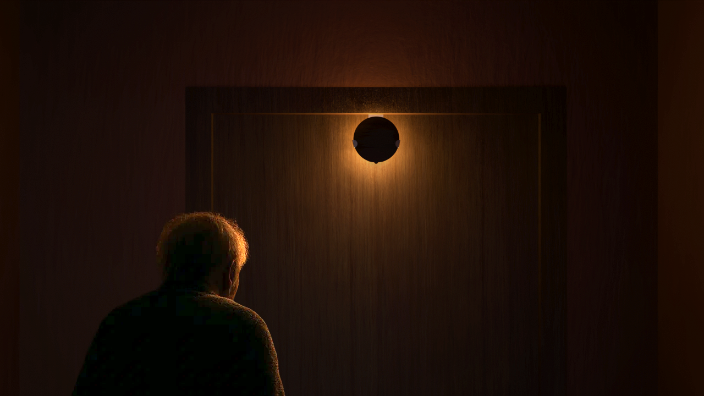

# Orion
*Een slim hulpmiddel dat de nachtrust en gemoedsrust van een mantelzorger van een persoon met dementie verbetert, door de nachtelijke oriëntatie in ruimte en tijd en de slaapkwaliteit van de persoon met dementie te ondersteunen.*

*Projectteam: Elias Verdegem; Viktor Fabry*

23/05/2025

`PD` persoon met dementie  
`MZ` mantelzorger (bv. partner)  
`PZ` professionele zorgverlener  
`IZ` informele zorgverlener (bv. familielid)

## Samenvatting

_Dit project richt zich op het probleem van **verstoorde dag-nachtritmes bij mensen met dementie**, wat zowel hun slaap als de nachtrust van hun verzorgers verstoort._

Het probleem is geanalyseerd door middel van **bevragingen en observaties**, waarbij de verschillende aspecten en gradaties zijn geïdentificeerd. Vervolgens is met behulp van **vijf iteraties aan prototypes** onderzocht hoe het zintuiglijke spectrum optimaal benut kan worden om de PD in zijn zelfstandigheid te ondersteunen.

Een combinatie van **visuele en auditieve prikkels** op strategische plaatsen doorheen de nachthal **begeleidt de PD bij een nachtelijk toiletbezoek** en **voorkomt het mogelijks daarop volgende nachtelijke dwalen**.

> ✨ **_Slimme lampjes verlichten de route en vormen oriëntatiepunten._** 
> ⌛ **_Een geruststellende herkenbare stem herinnert aan tijd en nachtrust._** 
> ❗ **_Bij afwijking wordt de MZ meteen visueel gewaarschuwd._**

Door de hulp kan de PD ’s nachts zijn plan trekken. De MZ kan met een gerust hart doorslapen.

**_Orion_** *belooft zo de zelfstandigheid van mensen met dementie te bevorderen, hun onrust te verminderen en de belasting voor mantelzorgers te verlichten en maakt zo thuiszorg aangenamer en duurzamer.*

  

> 🎥 [Ontdek hoe Orion werkt](https://www.youtube.com/watch?v=VIDEO_ID)

## Introductie

> _“Wanneer de nachten te zwaar worden, moeten mantelzorgers [hun partner] loslaten – niet omdat ze willen, maar omdat ze niet meer kunnen.”_ – zorgverlener

Mensen worden steeds ouder. In 2023 in België gemiddeld 82,5 jaar  (PwC, 2024) [^1]. De keerzijde van de medaille is dat hierdoor chronische ouderdomsziektes zoals Alzheimer's vaker voorkomen. **Op vandaag krijgt ongeveer 1 op 5 in de loop van zijn of haar leven een vorm van dementie.** Dementie is een wereldwijd probleem dat 55 miljoen mensen treft en jaarlijks 10 miljoen nieuwe gevallen kent. In België lijden ongeveer 200.000 personen aan een vorm van dementie, en door de vergrijzing wordt verwacht dat dit aantal tegen 2070 zal verdubbelen (Expertisecentrum Dementie, 2021) [^2]. In het toekomstige value based healthcare (VBHC) model (PwC, 2024) [^1] **wordt de zorgverlening verder richting de eerstelijns- en nuldelijnszorg verschoven**. Dit moet onder andere een oplossing bieden aan het groeiende personeelstekort in de gezondheidssector. **Deze evolutie onderstreept het belang van de informele zorgverlener en in het bijzonder de mantelzorger in het geval van zorg voor mensen met dementie.**

**Personen met dementie hebben moeite met een standaard slaappatroon, wat leidt tot nachtelijke onrust en dwalen** (Thomas & Ritter, 2022) [^3]. Dit verstoort niet alleen de nachtrust van de persoon met dementie zelf, maar ook die van hun mantelzorgers, vaak de partner. **Deze aanhoudende belasting kan leiden tot fysieke en emotionele uitputting van de mantelzorger**, wat de beslissing tot een vaste opname in een woonzorgcentrum kan bespoedigen.

**Het doel van dit project is om een oplossing te ontwikkelen die de nachtrust van PD en hun MZ bevordert, zodat thuiszorg langer mogelijk blijft**. Daarbij is het cruciaal om de autonomie van de zorgbehoevende te ondersteunen en de druk op MZ te verlagen. Dit vereist oplossingen die rekening houden met de **uiteenlopende en veranderende cognitieve en zintuiglijke capaciteiten van PD**. De focus ligt op het minimaliseren van nachtelijke interventies en het ondersteunen van een zelfstandig dag-nachtritme. De ontwikkelde oplossing moet bovendien flexibel zijn en ook in een woonzorgcentrum gebruikt kunnen worden om de professionele zorgverleners te ontlasten.

## Methodologie

De methodologie volgt het **triple diamond** ontwerpmodel, bestaande uit vier fasen: **discover**, **define**, **develop** en **deliver**.

In de fase **discover** wordt via een **literature review (N=16)** onderzoek gedaan naar uitdagingen in de zorg voor personen met dementie. Vervolgens vinden **user interviews (N=4)** plaats met mantelzorgers, familieleden en zorgverleners, waarbij gebruik wordt gemaakt van **empathy mapping**. Daarnaast wordt via **ethnography (N=1)** de dagelijkse praktijk geobserveerd in dagverblijf DVC Robijn, afdeling dementie, binnen WZC Sint Eligius. De verzamelde inzichten zijn gestructureerd weergegeven in een **fishbone diagram**, waarbij vooral het verstoorde dag-nachtritme en de daarmee samenhangende belasting voor mantelzorgers naar voren komen als prioritair probleem. Een aanvullend **state of the art**-onderzoek leidt tot het initiële concept van de klinkklok als vertrekpunt voor verdere testen.

Tijdens de **define**-fase worden prototypes iteratief ontwikkeld en geëvalueerd in testwaves, met elk een specifieke focus. In **wave 1** worden **conceptuele prototypes** (klinkklok, vloerlicht, breadcrumbs) onderzocht via **user feedback sessions (N=7)** met mantelzorgers en professionele zorgverleners in Huize Ter Walle, en via **user feedback sessions (N=3)** in DVC Robijn. Nadien wordt een stap teruggenomen met een gerichte **literature review (N=1)** over de problematiek van dwalen en sundowning. In **wave 2** worden de bevindingen toegepast als **feature prototypes** (beacon, breadcrumb, kussen, knuffel) die zich richten op het vaststellen van de featureset via een **evaluation matrix**, met **Wizard of Oz testing (N=3)** bij ouderen met en zonder dementie. Voorafgaand vindt er een ongeplande **user evaluation (N=1)** plaats met een expert in fixatie en valpreventie. De resultaten zijn geprioriteerd volgens de **MoSCoW-methode**, wat resulteert in een productconcept bestaande uit licht en geluid nabij het bed, de slaapkamerdeur en het sanitair, inclusief een feedbacksysteem voor mantelzorgers. Uitdagingen liggen in acceptatie, adaptatie en tijdige implementatie. Opties voor uitbreiding naar andere doelgroepen zijn onderzocht om het product reeds in een vroeg stadium van de ziekte te introduceren.

In de fase **develop** wordt via **CMF prototypes** (vlinderlampjes) de uiteindelijke look & feel bepaald, met behulp van een **interactive survey (N=12)** bij ouderen en ouders van jonge kinderen via **BERT-testing**. In **wave 4** zijn de **UI & UX prototypes** geëvalueerd via **Wizard of Oz testing (N=5)** met het **think aloud protocol**.

De laatste fase **deliver** omvat de evaluatie van volledig autonome prototypes (**wave 5**) als **pilot testing** via een **validation session (N=2)**.

## Discovery

### Doelstellingen

Een goed beeld vormen van wat de ziekte inhoud en de impact op de omgeving.

> ❓**Hoe draag je bij aan het mentaal welzijn van mantelzorgers** door hun tijd besteed aan zorg te optimaliseren?
> -	Welke lasten hebben de grootste impact op de mantelzorgers?
> -	Welke ontlasting heeft de grootste potentiële impact?
> -	Welke technologieën bestaan er?

### Materiaal & methoden

Het onderzoek vat aan met een **literature review (N=16)**. Artikels over het ziektebeeld en technologische vorderingen vormen het referentiekader. In een **technology scan** wordt bestaande technologie verzameld tot een beeld over de “state of the art”. Later in het onderzoek doen ze dienst als **benchmarks** voor de productideeën.

De literatuurstudie wordt gevolgd door **ethnographic fieldwork (N=1)** in de dagopvang in WZC St-Eligius. Het volgen van **a day in the life** van professionele zorgverleners en de gasten verrijkt met **contextual inquiries** worden in **field notes** verzamend. In een **cause-and-effect diagram** diagram worden de conclusies gestructureerd.

Een dieper inzicht in de dagelijkse impact van de ziekte op de naasten in thuissituaties zijn verkregen door **user interviews (N=4)** met eerste- en tweedelijns mantelzorgers. **Habit analysis** van frequente scenario’s en **empathy mapping** van de emotionele impact worden gehanteerd om kerngedachten te capteren.

Om te achterhalen voor welk probleem een oplossing binnen handbereik is, worden de bevindingen in een **feasability-desireabilitydiagram** geordend. Het meest zinvolle probleem wordt in een _how might we_ geformuleerd. **Personas** doen dienst als toetsing tijdens _definition_ fase.

### Resultaten

#### Literature review (N=16)

📄 [Protocol](https://ugentbe-my.sharepoint.com/:b:/g/personal/elias_verdegem_ugent_be/EdiS3hkiKK1MplGdmVTWungBmxVn0FbBp6aX2gbiq4Yjcw?e=3pP9zS)
📄 [Rapport](https://ugentbe-my.sharepoint.com/:b:/g/personal/elias_verdegem_ugent_be/EVpkX9X-c-hKqZcMqP5W1E4BfmoQJAslg8WdfgcqIlADtQ?e=OeRcE2)

Dementie is een complexe ziekte met uiteenlopende symptomen.
-	**Geheugen** en **cognitie** (woordvinding, planning en organisatie, oriëntatie in tijd)
-	**Gedrag** en **karakter** (apathie, agressie, angst, verdriet, kwaadheid)
-	**Functionele tekorten** in het dagelijkse leven (basale activiteiten, complexe activiteiten)

Er is een groeiende erkenning van de waardevolle rol van technologie in de ondersteuning van personen met dementie en hun zorgverleners. De meeste technologieën richten zich op de patiënt zelf.
-	**Communicatie** en **sociale interactie**
-	Fysieke **veiligheid** en **bewegingsvrijheid**
-	**Cognitieve stimulatie** en **geheugenondersteuning**
-	Ondersteuning voor dagelijkse zorgactiviteiten en **zelfredzaamheid**

**Artificiële intelligentie** is een belangrijke trend die hierin nieuwe mogelijkheden biedt. Omwille van de leeftijd en de achteruitgaande cognitieve capaciteiten van het doelpubliek brengt de introductie van nieuwe technologieën enkele belangrijke complexiteiten met zich mee.

#### User interviews (N=4)

📄 [Protocol](https://ugentbe-my.sharepoint.com/:b:/g/personal/elias_verdegem_ugent_be/EcmzMGjfi_pDri7_CiFLg6sBVcVGTVBcUN_csnUy3V1scA?e=q4lqXB)

  
  
  

Wat in de literatuurstudie nog onderbelicht lijkt, maar in de praktijk sterk naar voor komt, zijn de moeilijke nachten.

> _“Zit hij daar midden in de nacht aan de keukentafel, volledig gekleed, z’n krant aan ‘t lezen.”_ – mantelzorger en partner

Mantelzorgers willen de overstap van thuiszorg naar een woonzorgcentrum zo lang mogelijk uitstellen. Uit schrik om gescheiden te zijn, maar ook uit schaamte om te moeten toegeven dat ze het niet meer aankunnen.

> _“Na een week in kortverblijf is hij sterk achteruit gegaan. Sindsdien komt hij er niet meer bij zitten wanneer er bezoek is.”_ – tweedelijn informele zorgverlener (zoon)

#### Ethnography (N=1)

📄 [Protocol](https://ugentbe-my.sharepoint.com/:b:/g/personal/elias_verdegem_ugent_be/EbZtCITc4uJAq0ycfyGaPi8BeBhuUqo_bVPuqhUFXoU3WQ?e=zYbrPR)
📄 [Rapport](https://ugentbe-my.sharepoint.com/:b:/g/personal/elias_verdegem_ugent_be/EUZXoSR17MNIq53AvzIOdvEBZ89_BWPycliHvZ6ZHHcRLg?e=TfPVYO)

  
  
  

Ondanks het personeelstekort wijzen de professionele zorgverleners voornamelijk in de richting van de **mantelzorgers** wanneer het over overbelasting gaat. Ze spelen een cruciale rol doorheen de evolutie van de ziekte. Ze krijgen te kampen met **fysieke**, **emotionele**, **financiële** en **praktische** problemen.
Een gebrek aan **tijd** en **middelen** vormt veelal de onderliggende oorzaak.

> _“Wanneer we dan vragen hoe het met ze gaat, barsten ze in tranen uit.”_ – zorgverlener

Mantelzorgers wijden hun leven vaak volledig aan hun partner met de ziekte toe, ten koste van zichzelf. Liefde ruimt plaats voor gemis, frustratie en schaamte.
Dagcentra of een uitstap met een vrijwilliger of tweede lijn mantelzorger bieden ademruimte. Mantelzorgers hebben deze tijd nodig om van de vaak **korte nachten** en **zware zorgdagen** te recupereren en **sociaal isolement** te vermijden.
 

> _"[…] haar mantelzorger komt haar 's ochtends soms met tranen in de ogen afzetten." ... "Na 16u staat de mantelzorger er opnieuw alleen voor, net wanneer de gasten net heel overprikkeld zijn."_ – zorgverlener

Er is nood aan een oplossing die ook in de overige uren van de dag de autonomie van de zorgbehoevende ondersteunt.
Zowel in woonzorgcentra als in thuissituaties zijn **nachtelijke problemen** zeer uitputtend door de noodzaak voor permanente **waakzaamheid**. **Incontinentie**, **slapeloosheid**, **doolgedrag** en het bijhorende **valrisico** liggen hierbij aan de bron. 

> _"Sommigen zijn het dag-nachtritme volledig kwijt, wat leidt tot doolgedrag. Dan geef je ze slaapmedicatie, maar vergroot hun valneiging."_ – zorgverlener

De zorgbehoevende verhuist vaak stapsgewijs (via **dagverblijf**, **kortverblijf**, **aanleunflat**) van **thuis** naar **vast verblijf**." Dit valt de MZ heel zwaar en introduceert nieuwe verwarring bij de PD door een nieuwe onherkenbare omgeving.

> _”[…] Sociale Dienst merkt dan op dat de mantelzorger het niet meer aankan. […] Ze hebben het gevoel dat ze hun partner dumpen." [...] "Vanaf dan ben je gescheiden.”_ – zorgverlener

### Conclusies & implicaties

MZ van PD dragen een zware, vaak onzichtbare last. Vooral de **nachtelijke zorg** blijkt in de praktijk een cruciale maar onderbelichte bron van uitputting. Het doolgedrag, valgevaar, en het verlies van dag-nachtritme vereisen **permanente waakzaamheid**.

Hoewel bestaande technologieën zich hoofdzakelijk richten op de PD, ligt de **grootste potentiële impact** in oplossingen die de MZ ademruimte gunnen wanneer ze er alleen voor staan. Technologieën die de **autonomie ’s nachts** verhogen en onrust detecteren of vermijden, kunnen niet alleen de draaglast verlichten, maar ook het verblijf thuis aanzienlijk verlengen.

 

>🎯 **_How Might We?_** 
> **_Hoe kunnen we ’s nachts de autonomie van personen met dementie ondersteunen en nachtelijke interventies minimaliseren om zo de fysieke en mentale belasting van mantelzorgers te verlichten?_**

 

> 📌 **_Design Requirements_**
> - 1\. **Reduceert de noodzaak tot waakzaamheid** en beperkt het aantal nachtelijke interventies van de MZ
> - 2\. **Begeleidt in ruimte en tijd** om aan de zelfstandigheid en eigenwaarden van PD bij te dragen
> - 3\. **Interacties zijn intuïtief en herkenbaar** voor personen met beperkte oriëntatie- of geheugenfunctie
> - 4\. **Reist mee als vertrouwd element** om verwarring bij PD door wijzigende context te verminderen

## Definition I

### Doelstellingen

> ❓ _Hoe draag je bij aan de **nachtelijke zelfstandigheid** van een persoon met dementie?_
> - **Welke situaties** komen het vaakste voor?
> - **Welke interacties** (soort, timing, locatie) zijn intuïtief en behulpzaam?

### Materiaal & methoden

De definition fase wordt gestart met een **design sprint** waarin de **how might we** wordt vertaald in een **innovatrix** en **storyboards**.

Momenteel gebeurt het dat de PD gaat dwalen na op te staan voor een toiletbezoek. De waakzame MZ zal ’s nachts telkens opstaan om de PD opnieuw in slaap te helpen.

  

De eerste productiteratie is een lichtgevende klink op de slaapkamerdeur. Op basis van kleur wordt onderscheid gemaakt tussen dag en nacht. Een stem biedt tijdgebonden duiding. De klink onderscheidt de kamerdeur van de andere deuren.

  

  

> 🌊 Wave 1 – **conceptuele prototypes** – stimuli
> - **klinkklok**: zoals hierboven beschreven
> - **breadcrumbs**: slimme lichtbronnen die helpen bij veilig en zelfstandig nachtelijk navigeren
> - **vloerlicht**: een vloerdetector die nachtelijk opstaan detecteert en met licht dag-nacht onderscheid maakt en met rustgevend geluid helpt om opnieuw in slaap te vallen

De prototypes worden in een **user feedback sessions (N=10)** in Huize Ter Walle (N=7) en in DVC Robijn (N=3) aan MZs en PZs gedemonstreerd. Er zijn **groepsinterviews** afgenomen en individuele feedback is via een **enquête** verzameld.

### Resultaten

#### User feedback sessions (N=10)

📄 [Protocol](https://ugentbe-my.sharepoint.com/:b:/g/personal/elias_verdegem_ugent_be/EUDGs_sZqw1Cu-SNZ_Z4MUYB4EUygZoMUpzzzmrSuLFlzA?e=GaHmqu)
📄 [Rapport](https://ugentbe-my.sharepoint.com/:b:/g/personal/elias_verdegem_ugent_be/EYPAxhtVcARDhyRcBSE5QyAB_7105NtN1UUdGcgKd0noVQ?e=lRj64M)
📄 [Enquête](https://ugentbe-my.sharepoint.com/:b:/g/personal/elias_verdegem_ugent_be/Ef0tJbKGW_dAtwJForc6fqsBGBC1jhmTAPsUzSV54qDXcQ?e=y3iexh)
📄 [Resultaten](https://ugentbe-my.sharepoint.com/:b:/g/personal/elias_verdegem_ugent_be/ETZRhIU3ZTpDvh90dmZtsAcBM5H1ob_vPhDzmzgHq2v9hA?e=dr1w6v)

De meeste PDs kunnen nog wel kloklezen, maar staan geregeld op voor een **toiletbezoek**, een **glas water** of uit **verwardheid** (_”Ik moet gaan werken in de bakkerij.”, “Ik zoek mijn broer.”_. De MZs beschouwen hun nachtelijk hulp als een noodzaak en een evidentie, met het valrisico als hoofdreden.
> _”Ik ben niet gerust als ik niet mee ga als hij uit de kamer gaat.”_ – mantelzorger en partner

Bij sommigen overheerst de _status quo bias_. Doch blijken MZs zelf creatief in het zoeken naar oplossingen. Nachtelijke oriëntatie wordt ondersteund door **automatische verlichting** en geïmproviseerde **lichtlijnen**. Bij een verminderd tijdsbesef doet een **wake-up lampwekker** met **audioboodschap bij aanraking** dienst.

De cognitieve capaciteit van de PD in thuiszorg varieert sterk. Het **type prikkel is sterk individueel** te bepalen. De prikkel moet intuïtief zijn zoals **een licht of een herkenbare stem**. Kleurcodes zijn te complex.
 

Snoezelgeluiden zijn voor de een storend, voor de ander een slaaphulp. Licht op de deur of onder bed werkt net uitnodigend om op te staan. De prikkel moet zich aan het hoofddoel (het bed) bevinden.

De _breadcrumbs_ komen als winnaar uit zowel de gesprekken, als de enquête. Dit kan worden toegeschreven aan de **intuïtiviteit** (basale aantrekking van licht in ‘t donker), de **autonome werking** (geen complexe interactie en leercurve), de **herkenbaarheid** (domotica), eenvoudige **integreerbaarheid** en het **beperken van storende prikkels in de kamer**.
 

### Conclusies & implicaties

Een **verlichte nachthal** en een hulp bij het oriënteren door een **slimme aansturing** verlaagt het risico op dwalen en vallen. Volledige autonomie van de PD wekt ongerustheid bij MZs. Een adequate **feedback** is dus noodzakelijk.

> 📌 **_Design Requirements_**
> - 1.1. Bezorgt de MZ **feedback over de plaats en duur** van de nachtelijke uitstap
> - 2.1. **Helpt bij oriëntatie naar badkamer of toilet en terug naar bed**
> - 3.1. **Prikkelt gericht naar het hoofddoel** (toilet, kamer, bed)
> - 3.2. Prikkelt in de vorm van **lichtpunten en een herkenbare stem**
>- 3.3. De mee-slapende wordt **gedurende de nacht niet gestoord** door geluiden of licht boven de 5 lux in de kamer

## Definition II

### Doelstellingen

>❓ _Kunnen we het probleem **aan de bron aanpakken**?_
> - Wat veroorzaakt het verstoorde dag-nacht-ritme?
> - Welke doeltreffende oplossingen worden in de praktijk toegepast?

### Materiaal & methoden

Uit de eerste feedback blijkt dat de verstoorde nachtrust uiteenlopende oorzaken heeft, maar de MZs er zelf vaak de vinger niet op kunnen leggen. Een diepergaande **literature review (N=1)** over **dwaalgedrag en _sundowning_** verscherpt het referentiekader.

De bevindingen worden getest in verder uitgewerkte prototypes. De _breadcrumbs_ worden uitgebreid met de _beacon_. Een variant specifiek voor aan bed, met snoezelfuncties en een gerichte led die niet storend is voor de mee-slapende.

> 🌊 Wave 2 – **multisensory prototypes** – features
> - **Beacon**: multisensorieel toestel bij het bed (IR-afstandsbediening)
> - **Breadcrumb**: bewegingsgestuurde lampjes – (IR-afstandsbediening)
> - **Kussen** en **knuffel**: ademhaling simulerende comfortobjecten

Uit **benchmarks** kan worden geconcludeerd dat er betere varianten van het kussen (_Somnox_) en de knuffel (_Moonie_) op de markt zijn. De geïntegreerde functies worden met **Wizard of Oz testing (N=3)** bij de doelgroep getest. Voorafgaand wordt de werking uitvoerig besproken in een ongeplande **user evaluation (N=1)** met een experte fixatie en valpreventie.
Een **MoSCoW evaluation** helpt de essentie te destilleren.

### Resultaten

> _“Doordat veel ouderen overdag te weinig rust krijgen, zijn ze aan het eind van de dag uitgeteld. […] Ze worden rustelozer, willen naar huis of naar hun ouders, gaan rondlopen, zijn moeilijk gerust te stellen, verwarder en onsamenhangender. […] Het zogenaamde ‘Sundowning’.”_ – Facebookpagina Dementie Anders Beleven

#### Literature review (N=1)

📄 [Rapport](https://ugentbe-my.sharepoint.com/:b:/g/personal/elias_verdegem_ugent_be/EVuqMEwuGKBKsmLIZl0oRTYBc0NNRPol8vBCxzsqA2-cCg?e=P4wvQc)

Het artikel _Wandering and Sundowning  in Dementia_ [^3] onderscheidt drie deelgroepen o.b.v. cognitieve en fysieke capaciteiten. Een **lage cognitieve functie en hoge gedragsverstoringen** vormen het vaakst aanleiding tot dwalen. **Onrust, angst, en waanbeelden** verergeren de neuropsychiatrische symptomen.
- Preventieve maatregelen zijn **meer beweging en zonlicht overdag**.
- Acute maatregelen zijn het voorzien van een **rustige, goed verlichte omgeving** en **aroma- en muziektherapie**.

> 🌊 Aroma en geluid worden toegevoegd aan de _wave 2 prototypes_. De geur van eucalyptus, rustgevende [geluiden]( https://open.spotify.com/playlist/4VAuMb01iWAShef2yUGF71?si=1ebf38cc6ea94c5b) en lichtprojecties creëren een snoezelervaring voor ’t slapen. De geur van koffie vergezelt de lichtwekker.
> Van link naar rechts:
> - Zeebries (snoezel)
> - Ademhaling (snoezel)
> - Zonsopgang (wekker)
> - Alarm (feedback)

  
  
  
  

Bij het _ethnographic fieldwork_ kwam aan bod dat een donkere dorpel door sommige PD als een drempel wordt ervaren. Ook deze paper vermeld _”taping a **2-foot black threshold** in 
front of each door to serve as a visual barrier”_.

#### User review (N=1)

📄 [Rapport](https://ugentbe-my.sharepoint.com/:b:/g/personal/elias_verdegem_ugent_be/EXnrC_QwjRpIjKC0r4nMURQBxLFSH6Xwk91S0IcJtIyq2Q?e=Yyvibq)

Een gesprek met de experte fixatie en valpreventie van WZC St-Eligius geeft inzicht in de werking in een WZC-context.
-	**Spraakberichten** zoals _”het is nog nacht”_ zou de nachtdienst veel werk kunnen besparen. Ook in aanleunflats of thuissituaties waar de PD alleen slaapt, hoeft geluid niet uit de kamer geweerd te worden.
-	In WZC zou **feedback** via **DECT** moeten komen. Een instelbare gevoeligheid is wenselijk. MZs hebben tegenwoordig bijna allemaal een **smartphone**.
-	In WZC kent **aromatherapie** een belangrijke plek. Geuren als **eucalyptus, yland-ylang, sinaasappel en citroen** worden gebruikt voor het bestrijden van nervositeit, angst, boosheid, verwarring, slapeloosheid, etc.

#### Wizard of Oz testing (N=3)

📄 [Protocol](https://ugentbe-my.sharepoint.com/:b:/g/personal/elias_verdegem_ugent_be/EVgxVO37P6NCvh-ebd2gSRIBjbLRaMpq6a8uFbEiW7BVhg?e=qOb3VR)
📄 [Rapport](https://ugentbe-my.sharepoint.com/:b:/g/personal/elias_verdegem_ugent_be/EXnrC_QwjRpIjKC0r4nMURQBxLFSH6Xwk91S0IcJtIyq2Q?e=Yyvibq)

Bij het testen bij PD wordt duidelijk dat de dementiespecifieke features **schaamte en confrontatie** veroorzaken, wat een vlotte **acceptatie in de weg staat**. Een MoSCoW evaluation brengt de functies terug tot licht en spraak.

  
  
  

### Conclusies & implicaties

Symptomen van _sundowning_ in het product integreren leidt tot suboptimale hulpmiddelen, die stigmatiserend kunnen werken, de acceptatie van het basisproduct in de weg staan en de kostprijs onnodig opdrijven. **Spraak, licht en detectie definiëren het _minimum viable product_**. Het beoogde _mental model_ is een routeverlichting en een aangename geheugensteun. De _fluency heuristic_ stelt dat een **geleidelijke introductie van de hulpfuncties** de acceptatie ten goede komt.

> 📌 **_Design Requirements_**
> - 1.2. **Gevoeligheid van de feedback is instelbaar** via een app
> - 3.4. **Hulpfunctionaliteiten zijn instelbaar** via een app
> - 4.1\. **De modules zijn inwisselbaar**, de positie van de geluidsboodschappen is aanpasbaar
> - 5\. Maximale consumentenkostprijs van **€ 150 per module**

  

Een lichtlijn wordt als variant op de dikke zwarte lijn als barrière geïntroduceerd, door de _breadcrumbs_ van twee vleugels te voorzien.

  
  
  
  

## Develop I – look & feel

 ### Doelstellingen

Er wordt getracht het product **minder stigmatiserend** te maken, door de **doelgroep uit te breiden** en het beter in de omgeving te integreren. Het _MVP_ kan ook voor **ouderen zonder dementie** een hulp zijn. De oriëntatiehulp kan bovendien helpen bij **kinderen (2-4j)** die de babyfoon ontgroeid zijn.   
>❓ _Hoe kunnen we de **acceptie en adaptatie optimaliseren?**_
> - Welke **use-cases** komen in aanmerking?
> - Hoe zijn **look & feel** en doelgroep gerelateerd?

### Materiaal & methoden

Bij **scenario thinking** wordt het product denkbeeldig in de alternatieve gebruikscontexten geplaatst. Kinderen, jonge ouders, ouderen en personen met dementie hebben een **verschillend referentiekader** en zullen elk een andere _mental model_ vormen bij eenzelfde _system image_. **Variaties in fijne motoriek, cognitieve capaciteiten en het tweezijdig gebruik** (zorger versus verzorgontvanger) beïnvloeden de _affordances_ en _signifiers_. Variaties in praktische en esthetische voorkeuren beïnvloeden het kleur- en materiaalgebruik. Een [**morfologische matrix**](img/Prototypes%20morfologische%20matrix.png) stuurt de ontwikkeling van de nieuwe prototypevatianten.

 

> 🌊 Wave 3 – **CMF prototypes** – look & feel
> - **Boek**: kennis en rust – aardetinten, ruw
> - **Vlinder**: licht, speels en zacht – grijstinten, textiel
> - **Discobal**: futuristisch, opvallend, energiek – fluo color blocking, reflecterend
> - **Schelp**: veilig, clinisch – monochroom, metallic
> - **Pacman**: retro, herkenbaar – natuurlijk, hout

  
  
  
  
  

Voor elke gebruikscontext wordt telkens bij vier personen de intuïtieve, emotionele reactie op de esthetische kwaliteit bevraagd via **interactive BERT-survey (N=12)**. Tijdens de beoordeling worden vragen over gebruikssituaties en interacties gesteld.

### Resultaten

#### Interactive BERT-survey (N=12)

📄 [Protocol](https://ugentbe-my.sharepoint.com/:b:/g/personal/elias_verdegem_ugent_be/EQc9bVL98C1Bg9wy_j9wrJwBJp-GJjBEg8ULPVaeS8YLjg?e=RuK1Z6)
📄 [Rapport](https://ugentbe-my.sharepoint.com/:b:/g/personal/elias_verdegem_ugent_be/EZvJdp2McdxAnRVUZE21PdMB0frdUHorjLVcXtSo-ZZe9w?e=HnJsfv)
📄 [BERT-enquête](https://ugentbe-my.sharepoint.com/:b:/g/personal/elias_verdegem_ugent_be/Ef-kFxQShQdNrK5ER4mzfosBrSAzOw-ppaQV2JV5mDE-QA?e=NEIaNG)

**CMF**
-	De **houten, ronde vorm** van _pacman_ is het meest prototypische **interieurobject**.
-	Ouders hechten belang aan **stevigheid en reinigbaarheid**.
-	Enkel **kinderen verkiezen felle kleuren**.

**Context**
-	**Mobiele of geïntegreerde toestellen** genieten de voorkeur aangezien er vaak geen geschikte stopcontacten beschikbaar zijn.

**Gebruiksgemak**
-	Ouderen 75+ waarderen **eenvoudige aan/uit besturing** met duidelijke _signifiers_ zoals **fysieke knoppen**. Ze hebben moeite met onvoorspelbare automatische functies.

**Cognitie en emotie**
-	Licht en geluid werken ook bij kinderen geruststellend en oriënterend.
-	Kinderen scannen hun volledige omgeving, waar bij **ouderen de blik naar beneden** is gericht. 

### Conclusies & implicaties

Het **interieurobject** moet **robuust**, **hygiënisch**, **subtiel** en **personaliseerbaar** zijn. De **interactie intuïtief en eenvoudig** met een **fysieke aan/uit schakelaar**. Een module is **mobiel** en **onafhankelijk van stopcontacten**.

> 📌 **_Design Requirements_**
> - 4.2. Laat **verplaatsing zonder gereedschap** naar een nieuwe context toe
> - 6\. Laat **plaatsing en configuratie** door ouderen 75+ toe
> - 7\. Bestaat uit **metaal, hout en/of plastic**
> - 7.1. Komt in **3 esthetische varianten**

## Develop II – UI & UX

 ### Doelstellingen

Het verfijnen van de **fysieke, cognitieve en sensoriële ergonomie** en het bepalen van de _affordances_ en _signifiers_ met de focus op gebruik en begrip.
> ❓ **Wat maakt de interactie (UI) en ervaring (UX) aangenaam, doeltreffend en niet-intrusief?**

### Materiaal & methoden

De visuele en auditieve ergonomie wordt met **Wizard of Oz (N=3)** getest met een BLE-bediend UX prototype. Voor de fysieke interacties wordt een UI mockup gebruikt. De _ecological validity_ wordt gegarandeerd door de toestellen in een donkere omgeving op de deur of naast het bed te plaatsen. Een **moodboard** dient als leidraad voor de look & feel.

  

> 🌊 Wave 4 – **UI & UX prototypes** – comfort & gebruiksgemak
> - **UI mockup**: aan/uit bediening
> - **UX bluetooth remote**: licht- en geluidsspecificaties

  
  
  

Via het **think-aloud protocol** kunnen  _the gulfs of evaluation_ bij de gebruiker met het beoogde effect worden vergeleken. De resultaten zijn samengevat in een [**feature matrix**](img/Prototypes%20UI%20options.png).

### Resultaten

#### Wizard of Oz testing (N=3)

📄 [Protocol](https://ugentbe-my.sharepoint.com/:b:/g/personal/elias_verdegem_ugent_be/EbpEEQu65s1MsOD6PxRYUmsBMa9nkP9GNjpH73FM9u82Bg?e=3dqR0F)
📄 [Rapport](https://ugentbe-my.sharepoint.com/:b:/g/personal/elias_verdegem_ugent_be/EaTvNlM5hxRDjElFE4yJdeABiT8zmxKg7SMp7_JgvvWh1Q?e=RHhe7Z)
🔗 [Testing WebUI](https://eaverdeg.github.io/)

**Visuele ergonomie**
-	Een **translucente kap** maakt het naast het bed gepositioneerde toestel potentieel **geschikt als leeslamp**.
-	Indirecte verlichting bij de **matte kap voorkomt verblinding** in de hal.

**Fysieke ergonomie**
-	De trekschakelaar voldoet aan het _mental model_ van nachtverlichting bij ouderen, maar de PD kan het toestel onbedoeld uitschakelen.
-	Een **voldoende grote**, voor de PD **verborgen wipschakelaar** geniet de voorkeur. 

**Auditieve ergonomie**
-	**Duidelijkheid** en **herkenbaarheid** zijn cruciaal voor gehoorcomfort.

**Cognitieve ergonomie**
-	De **rode** waarschuwingsanimaties evoceert het **brandalarm-metafoor** en werkt onrustwekkend.
-	De **timer-animatie** communiceert helder en genuanceerd aan de hand van een **klok-metafoor**.

  
  
  

### Conclusies & implicaties

Het type licht (direct of indirect) is afhankelijk van de positie. De aan-/uit-bediening is eenvoudig voor de MZ maar verborgen voor de PD. Geluidsboodschappen hebben een grote invloed op de acceptatie en zijn sterk situatiegebonden. De feedback aan de MZ is op niet-alarmerende wijze voorzien.

> 📌 **_Design Requirements_**
> - 1.3. Geeft feedback via een **klokanimatie**.
> - 3.4. **Lichtintensiteit is instelbaar** van 5 tot 50 lumen.
> - 3.5. Wordt geleverd met **drie standaardgeluiden** en de mogelijkheid tot een **eigen opname**.
> - 7.2. Afdekkap komt in een **matte en translucente** variant.

## Deliver – proof of concept

### Doelstellingen

Een _proof of concept_ door het verwerken van de producteisen in een volledig functioneel prototype om met de hoogst mogelijke _ecological validity_ te testen bij de werkelijke eindgebruiker.

> ❓**Vervult het product de vooropgestelde _How Might We_?**
> - Wat zijn de **limitaties** van het product?
> - Welk **verder onderzoek** is noodzakelijk?

### Materiaal & methoden

Met behulp van enkele **cognitive walkthroughs** wordt een **behaviour flow** opgemaakt als blueprint voor de **system architecture**. De installatie werkt autonoom via wifi-connectie met een _Raspberry Pi_ en is opgesteld bij een PD en MZ thuis. De werking is vooraf doorlopen en is vervolgens een volledige nacht actief gebleven voor een **validation session (N=2)**. Na afloop is de MZ geïnterviewd over de bevindingen.

> 🌊 Wave 5 – **proof of concept prototypes** – effectiviteit & intuïtiviteit
> - **Drie geautomatiseerde lampen**: Arduino IoTs communiceren PIR- en GYRO-detectie via het MQTT-protocol met een Raspberry Pi die via state switching de leds en speaker aanstuurt. Zie technische beschrijving.

### Resultaten

**Validation sessions (N=2)**

*Testpersoon 1 – Zelftest (onderzoeker)*

De test werd uitgevoerd bij daglicht in een verduisterde woning. Alle componenten functioneerden technisch correct en het systeem trok op gepaste wijze de aandacht via licht en geluid. De gyro op het toilet bleek echter overgevoelig, wat leidde tot voortijdige activatie van de geluidsboodschap. De routeverlichting werd als duidelijk en subtiel ervaren.

  
  

*Testpersoon 2 – Persoon met dementie + mantelzorger*

Overdag werkte het systeem correct. Bij de nachtelijke test volgde het systeem de verwachte volgorde niet, ondanks correcte detectie bij het opstaan. Vermoedelijk is een foutieve triggering of plaatsing van de kamerdeursensor de oorzaak. De MZ gaf aan positief te zijn over het systeem en het potentieel te zien, mits verdere aanpassing aan hun specifieke situatie:

- Toilet bevindt zich op een ander verdiep

- MZ wil altijd gewekt worden bij nachtelijke activiteit van de PD

- Huis bevat reeds veel nachtverlichting – vraag naar extra breadcrumbs

  

  

**Gedragsobservatie & nabespreking**

Via het *think-aloud protocol* werd vastgesteld dat de interactie intuïtief verliep. Er was geen sprake van verwarring of overbelasting. De MZ waardeerde de autonomie die het systeem kan bieden, maar onderstreepte het belang van betrouwbaarheid en aanpasbaarheid. Er was geen negatieve reactie op licht of geluid.

#### Validation sessions (N=2)

📄 [Protocol](https://ugentbe-my.sharepoint.com/:b:/g/personal/elias_verdegem_ugent_be/Eba2SJnz_qJLk0D3Vfa5ZnQBhl0F5f7rrHB8iqlQefb_Kw?e=W9rya8)
📄 [Rapport](https://ugentbe-my.sharepoint.com/:b:/g/personal/elias_verdegem_ugent_be/EYsSF-ocI9BGpibg7Vrg9c0BDqhcAzFuGdlTmi8KfnNLWw?e=21pjaG)

…

### Conclusies & implicaties

Het systeem is intuïtief, maar nachtelijke betrouwbaarheid moet beter. Modulair ontwerp en instelbare functies zijn cruciaal. MZ-waarschuwing is noodzakelijk.
Er is een potentiële markt voor het product, mits verdere personalisatie naargelang specifieke situaties van mantelzorgers.

> 📌 **_Design Requirements_**
> -  Modules per ruimte configureerbaar
> -  Instelbare sensorgevoeligheid
> -  Mantelzorgermelding bij activiteit
> -  Extra breadcrumb-verlichting mogelijk
> -  Scenario-templates voor eenvoudige setup

## Conclusie

**_Orion_** is een nachtroutinetool die de zelfstandigheid van personen met dementie ondersteunt en mantelzorgers ’s nachts ontlast. Door visuele en auditieve prikkels strategisch in te zetten, helpt het systeem nachtelijk dwalen te voorkomen en de slaapkwaliteit te verbeteren. De oplossing is tot stand gekomen via diepgaand veldonderzoek, iteratieve prototyping en gebruikerstesten in realistische contexten. **Het eindresultaat is een flexibel, intuïtief en minimalistisch hulpmiddel dat in verschillende zorgomgevingen inzetbaar is**. _Orion_ toont zo aan hoe technologie empathisch kan bijdragen aan duurzame thuiszorg.

  
  

> 📌 **_Design Requirements_**
> - 1\. **Reduceert de noodzaak tot waakzaamheid** en beperkt het aantal nachtelijke interventies van de MZ
>   - 1.1. Bezorgt de MZ **feedback over de plaats en duur** van de nachtelijke uitstap
>   - 1.2. **Gevoeligheid van de feedback is instelbaar** via een applicatie
> - 2\. **Begeleidt in ruimte en tijd** met als doel aan de zelfstandigheid en eigenwaarden van PD bij te dragen
>   - 2.1. **Helpt bij oriëntatie naar badkamer/toilet en terug naar bed**
> - 3\. **Intuïtieve, herkenbare interacties** voor personen met beperkte oriëntatie- of geheugenfunctie
>   - 3.1. **Prikkelt gericht naar het hoofddoel** (toilet, kamer, bed)
>   - 3.2. Prikkels in de vorm van **lichtpunten en een herkenbare stem**
>   - 3.3. De mee-slapende wordt **gedurende de nacht niet gestoord** door geluiden of licht boven de 5 lux in de kamer
>   - 3.4. **Regelbare lichtintensiteit** van 5 tot 50 lumen
>   - 3.5. Wordt geleverd met **drie standaardgeluiden** en mogelijkheid tot een **eigen opname**
> - 4\. **Reist mee als vertrouwd element** om verwarring bij PD door wijzigende context te verminderen
>   - 4.1. **Modulair systeem** om aan de eisen van de gebruiker te voldoen
>   - 4.2. Laat **verplaatsing zonder gereedschap** naar een nieuwe context toe
> - 5\. **Maximale consumentenkostprijs van € 150 per module**
> - 6\. Toelaten van **plaatsing en configuratie** door ouderen 75+ 
> - 7\. Bestaat uit **metaal, hout en/of plastic**
>   - 7.1. Komt in **3 esthetische varianten**

## Technische beschrijving

### Samenstelling

- Drie modules, elk met een Arduino Nano 33 IoT en een PIR-sensor en één met een speaker, maken via wifi verbinding met een Raspberry Pi 3.
- Op de Pi is een IoT stack geïnstalleerd. ([instructies](https://github.com/basbaccarne/comon_expo))
- Onderlinge communicaties over PIR- en GYRO-detectie (Arduino) en de _system state_ (Pi) gebeurt via het MQTT-protocol. De _system state_ stuurt de leds en speaker in de modules aan.

### Electronica

Lichtarmatuur (x3)
- [Arduino Nano 33 IoT](https://www.gotron.be/arduino-nano-33-iot-zonder-headers.html)
- [Raspberry Pi 3](https://www.raspberrypi.com/products/raspberry-pi-5/)
- [Led-ring](https://www.otronic.nl/nl/24-bit-rgb-leds-ws2812b-cirkel-rond-neopixel.html?source=googlebase&gad_source=1&gclid=Cj0KCQjwkZm_BhDrARIsAAEbX1GCSt1FU_-lqwhs-2C0fQgxupHfj0l1B38h1cv5iahTJv1isrumIbcaAt71EALw_wcB#gad_source_1)
- [PIR sensor](https://www.gotron.be/pir-motion-sensor.html) (x1)
- [Schakelaar](https://www.gotron.be/componenten/schakelmat/schakelaars/toestel/toestelschakelaar-enkelpolig-on-off-spst-6a-250v-zwart.html)

Luidspreker add-on (x1)
- [MP3-module](https://www.gotron.be/dfplayer-pro-een-mini-mp3-speler-met-128mb-geheugen-onboard.html)
- [Luidspreker](https://www.gotron.be/miniatuurluidspreker-66mm-2w-8ohm.html)
Optioneel:
- [AA batterijhouders](https://www.gotron.be/energie/batterijen/batterijhouder/batterijhouder-voor-1-x-aa-cel-met-draden.html) (x3)
- AA batterijen (x3)
- [Step-up converter](https://www.otronic.nl/nl/mt3608-2a-max-dc-dc-step-up-power-module-booster-p.html)

Circuit (kabels, connectoren, weerstanden, etc.)

### Hardware

- Behuizing (x3)
  - [Haak](cad/haak.stl)
  - [Ring](cad/ring.stl)
  - [Pasvorm 1](cad/pasvorm%201.stl)
  - [Pasvorm 2](cad/pasvorm%202.stl)
- Diffuser (x3)
  - [Schijf](cad/schijf.stl)

### Software

- Arduino code voor timing en communicatie (licht en geluid)
  - [Main]("src/pilot/src/main.cpp")
  - [Actuatoren]("src/pilot/src/actuators.cpp")
- Raspberry pi code voor state switching
  - NodeRED [json export]("src/pilot/src/Raspberry Pi/orion_NodeRED.json")
  - Grafana dashboard [json export]("src/pilot/src/Raspberry Pi/orion_Grafana.json")
- Applicatie voor configuratie
 

## Kritische reflectie

De _technological divide_ en de _status quo bias_ blijven een barrière, zowel voor diepgaand gebruikersonderzoek als de uiteindelijke acceptatie. Vooral professionele zorgverleners en daarnaast ook mantelzorgers zien potentieel in het product, wat aangeeft dat Orion op de goede weg is.

Het product ondersteunt momenteel een aantal specifieke situaties. Echter, er zijn nog diverse randgevallen die onderzocht moeten worden om de werking robuuster en breder toepasbaar te maken. De introductie van kunstmatige intelligentie om nachtelijke patronen te analyseren, vormt hierbij een mogelijke benadering.

Hoewel het gebruik bij kinderen enkele inzichten heeft opgeleverd, is het bij nader inzien niet nodig om deze doelgroep verder te behandelen. Het aanpassen van de vormgeving en het instelbaar maken van bepaalde - potentieel stigmatiserende - functies kunnen de adaptatiegraad verhogen. De intuïtieve werking voorkomt een leercurve, waardoor een vroege introductie geen noodzaak is.

## Bijlagen

### Discover
- Literature review
  - [Protocol](https://ugentbe-my.sharepoint.com/:b:/g/personal/elias_verdegem_ugent_be/EdiS3hkiKK1MplGdmVTWungBmxVn0FbBp6aX2gbiq4Yjcw?e=3pP9zS)
  - [Rapport](https://ugentbe-my.sharepoint.com/:b:/g/personal/elias_verdegem_ugent_be/EVpkX9X-c-hKqZcMqP5W1E4BfmoQJAslg8WdfgcqIlADtQ?e=OeRcE2)
- User interviews
  - [Protocol](https://ugentbe-my.sharepoint.com/:b:/g/personal/elias_verdegem_ugent_be/EcmzMGjfi_pDri7_CiFLg6sBVcVGTVBcUN_csnUy3V1scA?e=q4lqXB)
  - [Rapport](https://ugentbe-my.sharepoint.com/:b:/g/personal/elias_verdegem_ugent_be/EUxWuQ6OHRBBsqC9CrPRgI8ByjO5FftoaaS89HSN1k0SQQ?e=l8HrYT)
- Ethnography
  - [Protocol](https://ugentbe-my.sharepoint.com/:b:/g/personal/elias_verdegem_ugent_be/EbZtCITc4uJAq0ycfyGaPi8BeBhuUqo_bVPuqhUFXoU3WQ?e=zYbrPR)
  - [Rapport](https://ugentbe-my.sharepoint.com/:b:/g/personal/elias_verdegem_ugent_be/EUZXoSR17MNIq53AvzIOdvEBZ89_BWPycliHvZ6ZHHcRLg?e=TfPVYO)

### Define
- [Testimonials](https://ugentbe-my.sharepoint.com/:b:/g/personal/elias_verdegem_ugent_be/EWyvy-P7P6lCo79PSqwTZOcBr3zRq12eMHFV4EmILDvBsg?e=ta0Xfr)
- [Literature review](https://ugentbe-my.sharepoint.com/:b:/g/personal/elias_verdegem_ugent_be/EVuqMEwuGKBKsmLIZl0oRTYBc0NNRPol8vBCxzsqA2-cCg?e=Nf0qWs)
- Prototypes wave 1
  - [Protocol](https://ugentbe-my.sharepoint.com/:b:/g/personal/elias_verdegem_ugent_be/EUDGs_sZqw1Cu-SNZ_Z4MUYB4EUygZoMUpzzzmrSuLFlzA?e=GaHmqu) - [enquête](https://ugentbe-my.sharepoint.com/:b:/g/personal/elias_verdegem_ugent_be/Ef0tJbKGW_dAtwJForc6fqsBGBC1jhmTAPsUzSV54qDXcQ?e=y3iexh)
  - [Rapport](https://ugentbe-my.sharepoint.com/:b:/g/personal/elias_verdegem_ugent_be/EYPAxhtVcARDhyRcBSE5QyAB_7105NtN1UUdGcgKd0noVQ?e=lRj64M) - [resultaten enquête](https://ugentbe-my.sharepoint.com/:b:/g/personal/elias_verdegem_ugent_be/ETZRhIU3ZTpDvh90dmZtsAcBM5H1ob_vPhDzmzgHq2v9hA?e=dr1w6v)
- [Matrix evaluation](https://ugentbe-my.sharepoint.com/:b:/g/personal/elias_verdegem_ugent_be/EXnrC_QwjRpIjKC0r4nMURQBxLFSH6Xwk91S0IcJtIyq2Q?e=Yyvibq)
- Prototypes wave 2
  - [Literature review](https://ugentbe-my.sharepoint.com/:b:/g/personal/elias_verdegem_ugent_be/EVuqMEwuGKBKsmLIZl0oRTYBc0NNRPol8vBCxzsqA2-cCg?e=P4wvQc)
  - [Protocol](https://ugentbe-my.sharepoint.com/:b:/g/personal/elias_verdegem_ugent_be/EVgxVO37P6NCvh-ebd2gSRIBjbLRaMpq6a8uFbEiW7BVhg?e=qOb3VR)
  - [Rapport](https://ugentbe-my.sharepoint.com/:b:/g/personal/elias_verdegem_ugent_be/EXnrC_QwjRpIjKC0r4nMURQBxLFSH6Xwk91S0IcJtIyq2Q?e=Yyvibq)
  - [Arduino code Beacon](/tests/Beacon.ino)
  - [Arduino code Breadcrumb](tests/Breadcrumb.ino)
- [User Flow](https://ugentbe-my.sharepoint.com/:b:/g/personal/elias_verdegem_ugent_be/EUmTUIAKd8ZKhQMbT16yuzMBDt6p4VjeiizfwWYc89rwLw?e=mRQy1Y)

### Develop
- Prototypes wave 3
  - [Protocol](https://ugentbe-my.sharepoint.com/:b:/g/personal/elias_verdegem_ugent_be/EQc9bVL98C1Bg9wy_j9wrJwBJp-GJjBEg8ULPVaeS8YLjg?e=RuK1Z6) - [BERT-enquête](https://ugentbe-my.sharepoint.com/:b:/g/personal/elias_verdegem_ugent_be/Ef-kFxQShQdNrK5ER4mzfosBrSAzOw-ppaQV2JV5mDE-QA?e=NEIaNG)
  - [Rapport](https://ugentbe-my.sharepoint.com/:b:/g/personal/elias_verdegem_ugent_be/EZvJdp2McdxAnRVUZE21PdMB0frdUHorjLVcXtSo-ZZe9w?e=HnJsfv)
- Prototypes wave 4
  - [Protocol](https://ugentbe-my.sharepoint.com/:b:/g/personal/elias_verdegem_ugent_be/EbpEEQu65s1MsOD6PxRYUmsBMa9nkP9GNjpH73FM9u82Bg?e=3dqR0F) - [Testing WebUI](https://eaverdeg.github.io/)
  - [Rapport](https://ugentbe-my.sharepoint.com/:b:/g/personal/elias_verdegem_ugent_be/EaTvNlM5hxRDjElFE4yJdeABiT8zmxKg7SMp7_JgvvWh1Q?e=RHhe7Z)
- Prototypes wave 5
  - [Protocol](https://ugentbe-my.sharepoint.com/:b:/g/personal/elias_verdegem_ugent_be/Eba2SJnz_qJLk0D3Vfa5ZnQBhl0F5f7rrHB8iqlQefb_Kw?e=W9rya8)
  - [Rapport](https://ugentbe-my.sharepoint.com/:b:/g/personal/elias_verdegem_ugent_be/EYsSF-ocI9BGpibg7Vrg9c0BDqhcAzFuGdlTmi8KfnNLWw?e=21pjaG)

### Deliver
- [Explainer video]()
  - [Script](https://ugentbe-my.sharepoint.com/:b:/g/personal/elias_verdegem_ugent_be/EcioSIA9y9ZAlRPYxw0DY-EBSUCkpOe41N7b1oHjZXvO0w?e=Y3X2C9)

[^1]: Vriens, K., Sage, C., d’Otreppe, P., Koster, F., & Christiaens, E. (2024, december). _A new era in Belgian healthcare: Key findings and collaborative insights towards implementation of value-based healthcare_. PwC Enterprise Advisory BV. In opdracht van de Belgian Association of Hospital Managers.

[^2]: Alzheimer Liga Vlaanderen. (2020). _Prevalentie van dementie_. Dementie.be. https://www.dementie.be/home/wat-is-dementie/prevalentie/

[^3]: Thomas, T., & Ritter, A. (2022, juni). _Wandering & sundowning in dementia_. Practical Neurology, 21(3), 36–39, 44.
